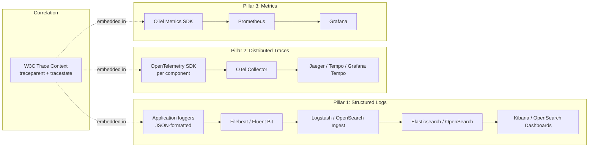
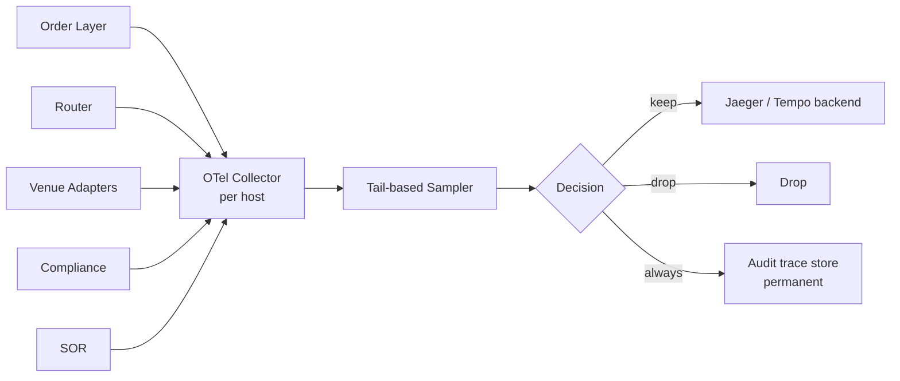

# Observability — Logging, Tracing, Metrics

The EMS's **three-pillar observability stack**: structured logs (ELK), distributed traces (OpenTelemetry, W3C trace context), and metrics (OpenTelemetry metrics → Prometheus). Designed so that **every action — from the moment a client connects at the [[entry-point-aaa|AAA service]] through fills coming back from a venue weeks later** — carries the same correlation IDs and can be reconstructed end-to-end across components, processes, hosts, and asset classes.

## Why this is non-negotiable

The EMS is distributed across many components ([[arch-order-staged]], [[arch-router-layer]], [[arch-smart-order-router|SOR]], [[arch-venue-connectivity]], [[arch-automation-layer]], [[arch-compliance]], [[arch-stp-pipeline]], etc.) communicating over [[arch-sbe-aeron-transport|SBE/Aeron]]. A single client action becomes dozens of events across components; without trace correlation, debugging and audit are impossible. Without structured logs, ops queries scale linearly with volume.

## Three pillars



The **correlation key** that ties all three together: the W3C `traceparent` (containing `trace_id` + `span_id`) is stamped on every log line, every span, and every emitted metric exemplar.

## Trace lifecycle

### Origin: the AAA service

A `trace_id` is generated at the **[[entry-point-aaa|AAA service]]** when a client operation arrives — not at session logon, but at **each operation** (each new logical action initiated by the client).

- API REST/gRPC: extract `traceparent` from inbound headers if the client sent one; else generate a new W3C trace ID at the AAA service.
- FIX inbound: extract `traceparent` from a custom FIX tag (e.g. `Tag 9700 TraceparentHex`) if the upstream OMS supports it; else generate at the AAA service.
- Automation rule firing: the rule binder's session has a parent trace; rule firings open new spans under it for each fired action.

The resulting `trace_id` is 16 bytes (W3C standard) — opaque to humans, queryable in Jaeger/Tempo/Kibana.

### Propagation

The `trace_id` flows through **every** medium:

| Medium | How trace context propagates |
|---|---|
| Internal SBE events on Aeron | `SessionHeader` extended with `traceparent` (16-byte trace_id + 8-byte span_id + flags) — see [[arch-sbe-aeron-transport]] |
| HTTP/gRPC inter-service | W3C `traceparent` header (standard) |
| FIX outbound to venues | Custom tag `Tag 9700` (or per-venue dialect) carries `traceparent`; standard FIX engines that don't understand it pass it through |
| Logs | Each log line includes `trace_id` + `span_id` JSON fields |
| Database queries | Query comments include `trace_id` for slow-query investigation |
| Outbound to ELK / Jaeger | Native context |

### Span model

Each component opens spans for its work:

```
[client request]                              <-- trace starts
  └─ AAA: authenticate + authorize
      └─ Validator: pre-trade checks
          ├─ Compliance: fat-finger / sanctions / list checks
          ├─ Risk: position-aware caps
          └─ Permission resolution
      └─ Order Layer: stage_orders
          └─ Event log: persist OrderAccepted
              └─ Subscribers fan out (each gets its own child trace context)
                  ├─ Automation: rule evaluation
                  │   └─ if rule fires → spans nest into resulting route_orders
                  └─ Blotter projection update
      └─ AAA: emit OperationCompleted
[response to client]                          <-- root span ends, others continue
```

Long-running operations (orders that take minutes to fill) **do not hold a single span open** for the whole life of the order. Instead:

- The originating client operation finishes its root span quickly.
- Each subsequent state change (`OrderReplaced`, `RouteFilled`, etc.) opens a **new span under the same trace_id** with a `span_link` back to the originating span. See [OpenTelemetry's `Span Links`](https://opentelemetry.io/docs/concepts/signals/traces/#span-links) for the standard pattern.

This keeps spans short-lived (good for backend storage) while preserving end-to-end correlation.

### Why W3C trace context (not a custom format)

- Standard. Supported by every major language SDK.
- Interoperable with upstream / downstream systems that already speak it.
- Vendor-agnostic — we can switch from Jaeger to Tempo to a SaaS without changing instrumentation.

## Logging — ELK / OpenSearch

### Structured JSON logs

Every log emitted is a JSON object:

```json
{
  "timestamp": "2026-06-06T16:23:14.123456Z",
  "level": "INFO",
  "service": "router",
  "version": "1.7.3",
  "trace_id": "4bf92f3577b34da6a3ce929d0e0e4736",
  "span_id": "00f067aa0ba902b7",
  "session_id": "ses-7f3a...",
  "identity": { "firm": "ACME", "desk": "FX_G10", "user": "j.doe" },
  "order_id": "ord-9b1c...",
  "route_id": "rte-d2e8...",
  "chain_id": "chn-5a4f...",
  "cl_ord_id": "CL-20260606-04812",
  "event": "RouteReplaceRequested",
  "venue": "MARKETAXESS",
  "qty": 5000000,
  "price": 102.135,
  "message": "Replace dispatched"
}
```

**Required fields on every line** (enforced by a logging wrapper): `timestamp`, `level`, `service`, `trace_id`, `span_id`. Domain-specific fields (`order_id`, `route_id`, `chain_id`, etc.) added by context.

### Pipeline: Filebeat → Logstash → Elasticsearch → Kibana

- **Filebeat / Fluent Bit** on each host tails service log files (or reads from stdout in a container env).
- **Logstash** (or OpenSearch Ingest pipelines) does parsing, enrichment, identity-aware redaction (KYC PII stripped if required by [[arch-jurisdictional-compliance]]).
- **Elasticsearch** (or OpenSearch — fully forked OSS variant) indexes; index lifecycle policy rolls into warm + cold + frozen tiers per regime retention (5y MiFID II / 7y SEC / etc.).
- **Kibana** (or OpenSearch Dashboards) for ops queries and saved searches.

### Index strategy

| Index pattern | Retention | Use |
|---|---|---|
| `ems-app-{date}` | 90 days hot, then warm to S3 | day-to-day ops |
| `ems-audit-{date}` | hot 1 year, cold 5–7 years per regime | compliance / regulator subpoena |
| `ems-trace-events-{date}` | 30 days hot, then frozen | trace-correlated event reconstruction |
| `ems-fix-wire-{date}` | hot 1 year, cold 5y | FIX session debugging |
| `ems-perf-{date}` | hot 30 days | perf investigation |

Audit-index logs are immutable post-index. Other indices may be replayed/rebuilt from the [[arch-event-sourcing|event log]] (the source of truth for state).

### PII / regulated-data handling

- Logs that touch licensed identifiers (CUSIP / SEDOL / ISIN) carry a `license_class` field; downstream visualization respects [[arch-symbology-figi|license metering]].
- KYC fields are redacted at ingestion for non-compliance indices.
- Sanctions-flagged records: separate restricted index with stricter ACL.

## Tracing — OpenTelemetry

### SDKs per component

Every component links the OpenTelemetry SDK appropriate for its language (Java / C++ / Go / Python / Node). Spans are created via the standard API; the SDK ships them async to the OTel Collector.

### Collector pipeline



### Sampling

- **Head-based sampling** (decision at trace start) for routine traffic — typical 1–5%.
- **Tail-based sampling** for error/anomaly conditions — keep 100% of traces with any error span, slow span (> p99 latency), or compliance/risk decision.
- **Audit-required traces** (any client-facing order/route/fill) are **always retained at 100%** in the audit trace store regardless of head/tail sampling. This is non-negotiable for best-ex audit ([[arch-best-execution]]) and reg reporting ([[arch-regulatory-reporting-service]]).

### Span attributes — required minimum

Every span carries:

- `service.name`, `service.version`
- `ems.session_id`
- `ems.firm_id`, `ems.desk_id`, `ems.user_id`
- `ems.order_id` (if applicable)
- `ems.route_id` (if applicable)
- `ems.chain_id` (see [[arch-identity-chaining]])
- `ems.event_type`
- Validator / compliance / risk decision spans: full reject code or pass

### Span links — long-lived order correlation

A fill arriving 2 hours after the originating client operation opens a new trace (the fill is a new client interaction from the venue's perspective). The new trace's root span uses a **span link** back to the originating order's root span:

```
fill_event.trace_id  = T2 (new)
fill_event.root_span.links = [
  { trace_id: T1 (original), span_id: S_origin, attributes: { link.kind: "ems.order.origin" } }
]
```

Querying "show me all spans related to order X" follows links transitively. Jaeger / Tempo support this natively.

## Metrics — OpenTelemetry → Prometheus

### Metric taxonomy

| Type | Naming | Examples |
|---|---|---|
| Counters | `ems_*_total` | `ems_orders_staged_total`, `ems_routes_sent_total`, `ems_fills_received_total`, `ems_validator_rejects_total{code}`, `ems_compliance_blocks_total{kind}` |
| Histograms | `ems_*_duration_seconds` | `ems_validator_duration_seconds`, `ems_route_to_first_fill_seconds`, `ems_sor_decision_seconds` |
| Gauges | `ems_*_active` | `ems_sessions_active`, `ems_orders_working`, `ems_routes_pending_replace` |

Naming follows Prometheus conventions (`_total` for counters, `_seconds` for time, `_bytes` for size) so existing Prometheus / Grafana tooling works without re-mapping.

### Exemplars

Histograms emit **exemplars** — one sample with its `trace_id` attached every N observations. Click a slow-latency bucket in Grafana → jump to the trace in Jaeger / Tempo. This is the operational glue that makes trace+metric correlation usable in incident response.

## Correlation across the three pillars

The user-facing observability is **one query** that pivots across all three:

```
Kibana log search → click trace_id → opens trace in Jaeger
Grafana metric → click exemplar → opens trace in Jaeger
Jaeger span → links to all related logs and metrics
```

This requires:

- Trace ID present in every log line ✓
- Trace ID present on every metric exemplar ✓
- Span attributes for indexable IDs (order_id, route_id, chain_id) ✓

## Propagation through SBE / Aeron

The [[arch-sbe-aeron-transport|SBE envelope]] is extended with trace fields:

```
SessionHeader {
  session_id      uint64
  seq_num         uint64
  send_time       uint64
  source          enum
  trace_id        bytes[16]    // W3C trace ID
  parent_span_id  bytes[8]     // parent span at the publisher
  trace_flags     uint8        // W3C trace flags (sampled bit etc.)
}
```

Receivers extract the trace context, open child spans for their work, and continue propagation. Adds 25 bytes/message — acceptable cost given the value.

## Propagation through FIX

Inbound FIX from clients can optionally carry trace context in a **custom tag** (we propose `9700 TraceparentHex` — a hex-encoded W3C `traceparent`). Outbound FIX to venues carries the same tag if the venue is in the firm's "trace-aware" allowlist; for venues that don't tolerate unknown tags, the trace ID is **stored locally** keyed by ClOrdID and re-attached when the venue's response arrives (using ClOrdID as the rejoining key).

See [[arch-fix-api-bridge]] for the tag mapping.

## ELK alternative: OpenSearch

OpenSearch (Apache 2.0 forked from Elasticsearch 7.10) is functionally equivalent for our purposes and avoids the Elastic License complications. The architecture described works identically on OpenSearch + OpenSearch Dashboards. Choose at deployment time based on firm policy.

## What lives outside this layer

- **Business decision audit** (compliance overrides, BEC sign-offs) goes through [[arch-event-sourcing|the event log]] — that is the legal source of truth. The observability stack is for **operations and debugging**, not for audit-of-record (though it complements it).
- **Per-trade regulatory reporting** is [[arch-regulatory-reporting-service]]'s job — observability backs incident investigation.
- **Best-ex audit reconstruction** is [[arch-best-execution]] over the event log; observability adds the operational lens.

## Deployment topology

| Tier | Components |
|---|---|
| Per-host | OTel Collector, Filebeat / Fluent Bit |
| Per-region cluster | Elasticsearch / OpenSearch, Prometheus, Jaeger / Tempo backend |
| Cross-region | Optional federation for global queries; per-jurisdiction data residency respected |

## See also

- [[entry-point-aaa]] (origin of trace_id per operation) · [[arch-identity-chaining]] (order/route chain IDs)
- [[arch-sbe-aeron-transport]] (envelope extension) · [[arch-event-sourcing]] (event log carries trace_id) · [[arch-fix-api-bridge]] (FIX trace tag)
- [[arch-jmx-introspection]] (component metrics) · [[arch-notification-service]] (incident alerting backed by traces)
- [[arch-jurisdictional-compliance]] (retention) · [[arch-symbology-figi]] (license-class enrichment)
- [[arch-best-execution]] · [[arch-regulatory-reporting-service]] · [[arch-validator]] · [[arch-compliance]] · [[arch-surveillance]]
