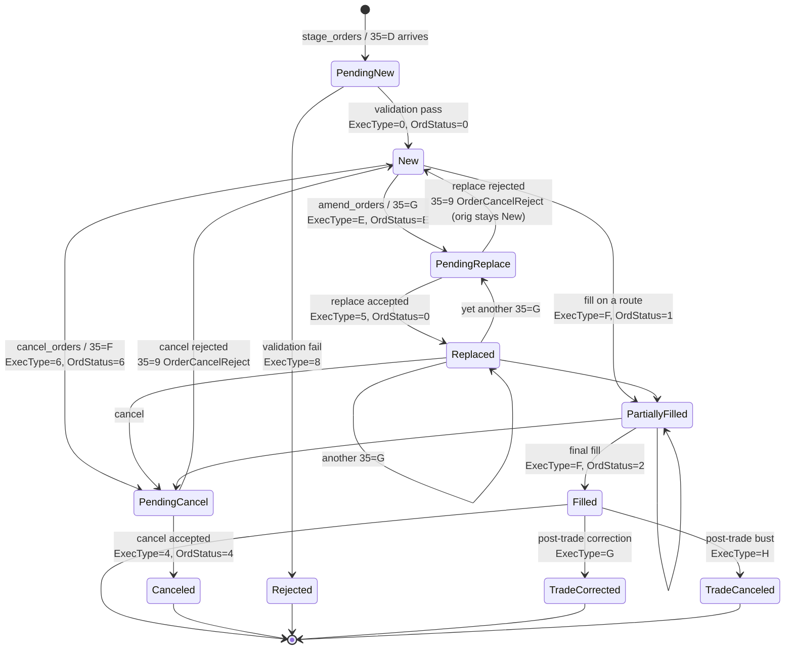
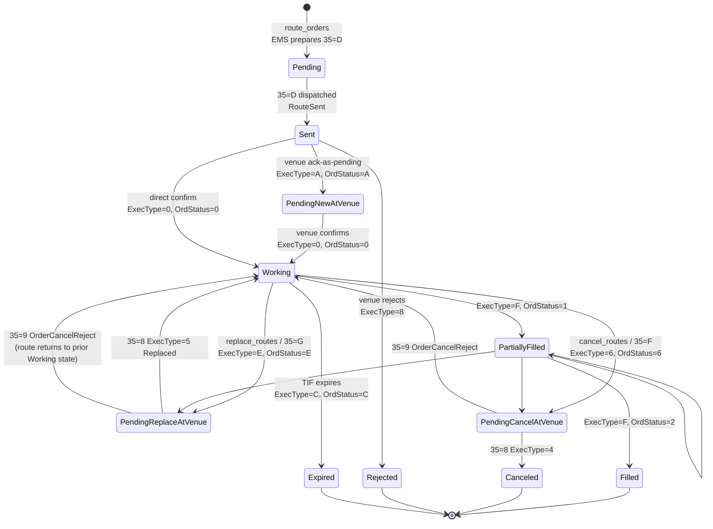
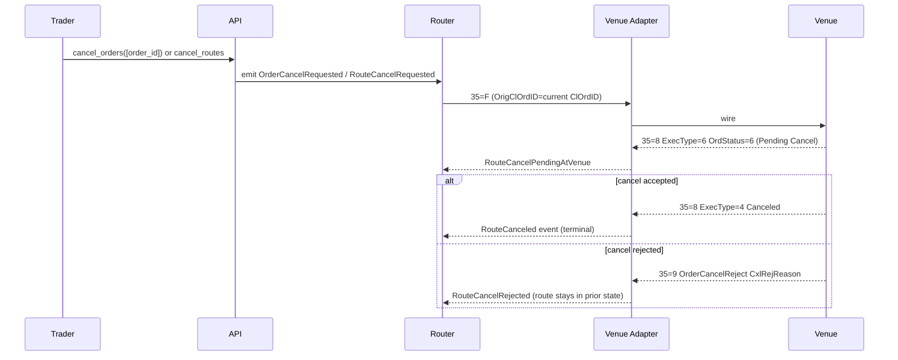

# Order & Route Lifecycle (FIX-Aligned)

The canonical state machines for orders and routes, expressed in **FIX semantics** so internal events, the FIX wire surface, and venue-side behaviour all share one vocabulary. The internal event names map 1:1 to FIX `MsgType` / `ExecType` (150) / `OrdStatus` (39) values.

Other notes ([[arch-order-staged]], [[arch-router-layer]], [[arch-fix-api-bridge]], [[amend-order]]) reference this note as the authoritative state model. Where they describe internal events (e.g. `OrderReplaced`, `RouteCancelRequested`), the FIX equivalent is what's defined here.

## Why FIX-align

FIX is the lingua franca for order lifecycle in every venue, OMS, and EMS the system touches. Inventing new names (`OrderCorrected`, `RouteAdjusted`, etc.) creates impedance at every translation boundary. Aligning eliminates ambiguity, makes audits readable by any FIX practitioner, and ensures the FIX bridge has no semantic translation work — only encoding work.

## Order lifecycle

### Inbound requests (FIX `MsgType`)

| MsgType | FIX message | EMS internal operation |
|---|---|---|
| `D` | NewOrderSingle | `stage_orders` (batch=1) |
| `E` | NewOrderList | `stage_orders` (batch=N) |
| `AB` | NewOrderMultileg | `stage_orders` with multileg envelope ([[arch-multileg]]) |
| `F` | OrderCancelRequest | `cancel_orders` |
| `G` | OrderCancelReplaceRequest (a.k.a. **Modify**) | `amend_orders` (see [[amend-order]]) |
| `AC` | MultilegOrderCancelReplace | `amend_orders` with multileg envelope |
| `H` | OrderStatusRequest | `query_order_status` |

### Outbound responses (FIX `MsgType`)

| MsgType | FIX message | Emitted on |
|---|---|---|
| `8` | ExecutionReport | every state transition |
| `9` | OrderCancelReject | rejection of `F` or `G` (note: rejecting a cancel/replace does **not** terminate the original order — it stays in its prior state) |
| `j` | BusinessMessageReject | session-/business-level reject pre-state |

### `OrdStatus` (39) and `ExecType` (150) values used

| 39 | 150 | Meaning | Internal event |
|---|---|---|---|
| `A` | `A` | Pending New | `OrderPendingNew` (between accept and persisted-new) |
| `0` | `0` | New | `OrderAccepted` (a.k.a. `OrderStaged` for orders in `STAGED` state pre-route, see [[arch-order-staged]]) |
| `E` | `E` | **Pending Replace** | `OrderReplaceRequested` |
| `5` | `5` (FIX 4.x) or `F` + replace context (FIX 5.0+) | **Replaced** | `OrderReplaced` |
| `6` | `6` | **Pending Cancel** | `OrderCancelRequested` |
| `4` | `4` | Canceled | `OrderCanceled` |
| `1` | `F` | Partially filled | `OrderPartiallyFilled` (fires per fill) |
| `2` | `F` | Filled | `OrderFilled` (terminal) |
| `8` | `8` | Rejected | `OrderRejected` |
| `C` | `C` | Expired | `OrderExpired` |
| `3` | `3` | Done for day | `OrderDoneForDay` |
| n/a | `D` | Restated | `OrderRestated` (system-initiated re-statement, no client change) |
| n/a | `G` | **Trade Correct** | `TradeCorrected` (post-fill price/qty correction) |
| n/a | `H` | **Trade Cancel** | `TradeCanceled` (post-fill bust) |

### Order state diagram



**Key FIX rules baked in:**

- A **rejected cancel/replace does not terminate the original order**. `35=9` OrderCancelReject leaves the order in its prior state — the request failed, not the order. Confirmed by `OrdStatus` (39) on the `35=9` reflecting the pre-existing state.
- A **Pending Replace** order can still **fill** on the original parameters while the replace is in flight. FIX semantics: the replace doesn't pause the working order; until the venue confirms `150=5 Replaced`, partials may print at the prior price/qty.
- **Queue priority** is venue-dependent. Many venues lose time priority on a price change or qty *increase*; qty *decrease* often preserves it. The EMS doesn't enforce this — it surfaces what the venue confirms.
- **Trade Correct (`150=G`)** and **Trade Cancel (`150=H`)** are post-fill lifecycle events used after the fact for cleared-up corrections (price was wrong, fill should never have happened). They are distinct from order-state cancels.

## Route lifecycle

A **route** is the EMS's outbound projection of an order to a venue. It carries its own ClOrdID, has its own lifecycle, and tracks the venue's view directly. The state machine mirrors the order's but **per route** — the FIX semantics are the same.

### ClOrdID rules

- Each `route` has a venue-facing `cl_ord_id` (FIX tag 11).
- A **replace** mints a **new `cl_ord_id`**; the prior `cl_ord_id` becomes `orig_cl_ord_id` (FIX tag 41) on the `35=G`. Standard FIX convention.
- A **cancel** carries the current `cl_ord_id` as `orig_cl_ord_id` on the `35=F`.
- Within the lifetime of a route, the EMS keeps the full `cl_ord_id` chain on the audit trail.

### Route state diagram



### Internal events ↔ FIX

The route's internal event names align with the FIX vocabulary:

| Internal event | Corresponds to |
|---|---|
| `RouteSent` | EMS outbound `35=D` dispatched (no venue response yet) |
| `RouteAcknowledged` | venue `35=8 ExecType=0 New` (or `A Pending New` then `0 New`) |
| `RouteWorking` | shorthand for `Working` state — set by ack |
| `RoutePartiallyFilled` | venue `35=8 ExecType=F OrdStatus=1` |
| `RouteFilled` | venue `35=8 ExecType=F OrdStatus=2` (terminal) |
| `RouteReplaceRequested` | EMS outbound `35=G` dispatched |
| `RouteReplacePendingAtVenue` | venue `35=8 ExecType=E Pending Replace` |
| `RouteReplaced` | venue `35=8 ExecType=5 Replaced` |
| `RouteReplaceRejected` | venue `35=9 OrderCancelReject` (route stays in prior state) |
| `RouteCancelRequested` | EMS outbound `35=F` dispatched |
| `RouteCancelPendingAtVenue` | venue `35=8 ExecType=6 Pending Cancel` |
| `RouteCanceled` | venue `35=8 ExecType=4 Canceled` |
| `RouteCancelRejected` | venue `35=9 OrderCancelReject` (route stays in prior state) |
| `RouteRejected` | venue rejected on submission `35=8 ExecType=8` |
| `RouteExpired` | venue `35=8 ExecType=C` (TIF reached) |
| `RouteAnomaly` | EMS-side: state inconsistency between EMS and venue requiring ops triage |
| `RouteSuperseded` | EMS-side: a replace required a cancel-and-resubmit pattern at a venue that doesn't support in-place replace; the prior route is closed and a new one issued. |

## Cancel/replace semantics — full sequence

```mermaid
sequenceDiagram
  participant T as Trader / Rule
  participant API as API
  participant V as Validator
  participant R as Router
  participant A as Venue Adapter
  participant X as Venue

  T->>API: amend_orders([{order_id, fields}])
  API->>V: validate post-amend state
  V-->>API: pass
  API->>R: emit OrderReplaceRequested (internal)
  R->>A: send 35=G (new ClOrdID=N, OrigClOrdID=O, modified fields)
  A->>X: wire
  X-->>A: 35=8 ExecType=E OrdStatus=E (Pending Replace)
  A-->>R: RouteReplacePendingAtVenue event
  R-->>API: (echo to FIX client if paired)
  alt replace accepted
    X-->>A: 35=8 ExecType=5 OrdStatus=0/1 Replaced
    A-->>R: RouteReplaced event
    R-->>API: OrderReplaced internal event
    API-->>T: (FIX echo if paired)
  else replace rejected
    X-->>A: 35=9 OrderCancelReject CxlRejReason=...
    A-->>R: RouteReplaceRejected event
    R-->>API: (order stays in prior state; not terminal)
    API-->>T: reject message (preserves prior state)
  end
```

**Note the rejection case:** the order is not terminated. The 35=9 carries the *current* `OrdStatus` (39) which reflects the state the order is *still* in. The EMS reflects this — `OrderReplaceRejected` is recorded for audit but the order's state field does not change.

## Cancel semantics — full sequence



## Post-fill corrections

For fills that turn out to be wrong (price was misquoted, fill never happened), FIX uses **Trade Correct (`150=G`)** and **Trade Cancel (`150=H`)** events. These are distinct from order-state cancels:

- A `35=8 ExecType=H` busted fill means the original fill is treated as if it never occurred; the order's `cum_qty` decreases.
- A `35=8 ExecType=G` corrected fill carries the corrected price/qty; the prior fill is superseded.

The EMS records `TradeCanceled` and `TradeCorrected` events accordingly. The order may transition back from `Filled` to `PartiallyFilled` (or even to `New`) if all fills bust. This is the **only** way an order's `cum_qty` ever decreases.

## OrderCancelReject reason codes

`35=9` carries `CxlRejReason` (tag 102):

| 102 | Meaning |
|---|---|
| 0 | Too late to cancel |
| 1 | Unknown order |
| 2 | Broker option |
| 3 | Order already pending cancel/replace |
| 6 | Duplicate ClOrdID |
| 99 | Other |

The EMS translates inbound venue 35=9 codes into `EMS-RTE-*` reject codes for the internal validator namespace; outbound from EMS to FIX-paired clients, the original 102 reason is preserved.

## In-flight rules summary

- **Replace request received while a prior replace is pending at the venue:** queue at EMS or pass through? FIX convention is one-pending-replace-per-order; the EMS enforces that on outbound to prevent venue 35=9 reason 3.
- **Cancel received while replace is pending:** EMS queues the cancel until the replace resolves, then issues cancel against the resulting state.
- **Fill received while replace is pending:** fill applies to the prior (un-replaced) parameters. The EMS records both events with explicit ordering; the replace either still goes through (against the diminished remaining qty) or rejects with `EMS-RTE-2030 replace_qty_below_cum_qty`.
- **Replace `Qty` ≤ `CumQty`:** standard FIX practice; venues typically reject. EMS validator catches this pre-flight when it can.

## Asset-class notes

- **FX / OTC:** many venues don't follow strict FIX cancel/replace; they may require cancel + new-order. The adapter normalizes by emitting `RouteSuperseded` events when this happens, so the internal event semantics are still cancel/replace at the API level.
- **Listed derivatives / equities:** standard FIX 35=G in-place replace is supported by most exchanges.
- **RFQ flows ([[route-to-rfq]]):** "amending" an RFQ typically means cancel-and-resend; modeled as `RouteSuperseded`.

## See also

- [[arch-fix-api-bridge]] · [[arch-order-staged]] · [[arch-router-layer]] · [[arch-event-sourcing]]
- [[amend-order]] · [[arch-sequence-recovery]] · [[arch-validator]]
- [[route-to-resting]] · [[arch-multileg]] · [[arch-venue-connectivity]]
