# Staged Order Manager (OMS Layer 1)

The first layer of the OMS holds **orders that may not yet be ready to route**. A staged order is a normalized intent — instrument, side, quantity, identity — plus whatever workflow steps the firm requires before the order is releasable.

## Why a staging layer

Most orders cannot go to a venue the instant they hit the EMS:

- A **broker** may need to be chosen.
- A **limit price** may need to be set after a benchmark observation.
- **Trader notes** may be required for compliance.
- **Borrow** may need sourcing (short equity).
- **Compliance** checks may need to pass.
- **Two-step approval** may be required — see [[two-step-approval]].
- An **automation rule** may be waiting to fire — see [[arch-automation-layer]].

The staged order is the **point of co-ordination** for all of these. Once the order is "ready" it transitions and becomes the [[arch-router-layer|router]]'s problem.

## State machine

The staged order state machine is **FIX-aligned**. Internal state names map directly to FIX `OrdStatus` (39) / `ExecType` (150) values — see [[arch-order-route-lifecycle]] for the canonical mapping table and the full transition diagram including amend/cancel intermediate states.

```mermaid
stateDiagram-v2
  [*] --> PendingNew: stage_orders / FIX 35=D
  PendingNew --> New: validation pass<br/>ExecType=0, OrdStatus=0<br/>(internal: OrderAccepted / OrderStaged)
  PendingNew --> Rejected: validation fail<br/>ExecType=8
  New --> Staged: pending_actions remain<br/>(EMS sub-state; FIX still sees OrdStatus=0 New)
  Staged --> Staged: amend / set field
  Staged --> Ready: pending_actions cleared<br/>(EMS sub-state)
  Ready --> Routing: route_orders<br/>(ownership transfers to router)
  New --> PendingReplace: amend_orders / 35=G<br/>ExecType=E, OrdStatus=E
  PendingReplace --> New: ExecType=5 Replaced
  PendingReplace --> New: 35=9 OrderCancelReject<br/>(order stays in prior state — replace failed, order did not)
  New --> PendingCancel: cancel_orders / 35=F<br/>ExecType=6, OrdStatus=6
  PendingCancel --> Canceled: ExecType=4
  PendingCancel --> New: 35=9 OrderCancelReject
  Routing --> Routing: see arch-router-layer
  Canceled --> [*]
  Rejected --> [*]
```



`STAGED` and `READY` are EMS-internal sub-states within the FIX `New` status — FIX clients see one `OrdStatus=0 New` regardless. The sub-states track whether `pending_actions` (broker selection, compliance approval, two-step approval) are still outstanding. See [[arch-order-route-lifecycle]] for the full FIX lifecycle covering Routing → PartiallyFilled → Filled / Canceled / Expired and the post-fill `TradeCorrect` / `TradeCancel` paths.

> **Important FIX rule**: an `OrderCancelReject` (35=9) **does not terminate the order** — it just rejects the cancel/replace request. The order remains in its prior state. See [[arch-order-route-lifecycle]] § "Cancel/replace semantics".

## Order envelope (canonical)

```
StagedOrder {
  order_id          UUID
  parent_id         UUID?              // multileg parent, aggregation parent
  instrument        FIGI               // see [[arch-symbology-figi]]
  side              BUY|SELL|SELLSHORT|BUYCOVER
  quantity          decimal
  remaining         decimal
  tif               DAY|GTC|GTD|IOC|FOK|GFA|GTX
  effective_date    date?
  expiry_date       date?
  limit_price       decimal?           // null until set
  account           AccountRef
  allocation_template AllocTemplateRef?
  broker            BrokerCode?        // null until chosen
  notes             [Note]
  custom_notes      map<string,string>
  tags              set<string>        // hashtag-style, see [[arch-firm-desk-user]]
  batch_name        string?            // Excel-staging grouping, distinct from tag groups
  group_id          string?            // distinct from batch_name — Group ID for cross-batch correlation
  state             NEW|STAGED|READY|ROUTING|CANCELLED|REJECTED
  required_fields   [FieldKey]         // computed from firm/desk/user/asset rules
  pending_actions   [ActionRef]        // e.g. NeedBorrow, NeedCompliance, NeedApproval2
  origin            FIX|API|EXCEL|UI|AUTO
  staged_by         Identity
  staged_at         timestamp
}
```

The `required_fields` and `pending_actions` lists are computed by [[arch-validator|the validator]] on every state transition. An order becomes `READY` only when both are empty.

## Asset-class extensions

Each asset class may attach a typed extension block:

| Asset class | Extension fields |
|---|---|
| Equity | `route_strategy_hint`, `dark_pool_pref`, `borrow_source` |
| FX | `value_date`, `tenor`, `is_swap_far_leg`, `prime_broker`, `pre_authorized_cpty` |
| FI | `cusip`, `settle_date`, `min_block_size`, `dealer_list` |
| Listed deriv | `leg_ratios[]`, `cross_type` |
| Options | `strike`, `expiry`, `right`, `delta_hedge_ref` |

Extensions are SBE-typed; the validator runs both the generic and the extension's rules.

## Operations

| Operation | Effect |
|---|---|
| `stage_orders([order])` | New orders enter, possibly with origin=FIX/EXCEL/API. See [[arch-fix-api-bridge]]. |
| `amend_orders([{order_id, fields}])` | Field-level edits. Each amend is a separate event in [[arch-event-sourcing]]. |
| `cancel_orders([order_id])` | Terminal transition. |
| `mark_ready([order_id])` | Trader explicitly releases. Validator must pass. |
| `set_pending_action_done([order_id, action_ref])` | Used by upstream services (e.g. compliance). |

All operations are **batch by default** — see [[arch-api-first]].

## Multi-source ownership

Orders can be edited from multiple surfaces (FIX origin, API amend). The [[arch-fix-api-bridge]] mixed-client rule applies:

- Pure FIX clients can only `stage`. They cannot `amend` or `cancel` someone else's order over FIX.
- API clients with the right permissions can manipulate any order the firm owns (subject to [[arch-tag-permissions]]).
- All state changes are mirrored back to the FIX session as `ExecutionReport` (`8`).

## What stays out of this layer

- Venue dialogue. That is [[arch-router-layer]].
- Quotes. That is [[arch-quote-server]].
- Rule firings. They sit between this layer and the router — see [[arch-automation-layer]].

## See also

- [[arch-router-layer]]
- [[arch-automation-layer]]
- [[arch-validator]]
- [[arch-tag-permissions]]
- [[arch-symbology-figi]]
