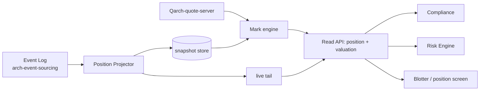

# Position Service

A projection of **current positions per account** derived continuously from fill events. Read-only from the consumer's perspective; updated by subscribing to [[arch-event-sourcing|the event log]]. Foundational for [[arch-compliance|compliance]] concentration checks, [[arch-risk-engine|risk]] position-aware caps, and post-trade P&L attribution.

## Purpose

A single authoritative position view, derived (not stored independently), available with sub-second freshness to any component that needs it. Positions change only by fills (and post-fill busts/corrects); the service rebuilds projections on demand and serves snapshots + tails.

## Projection model

```
Position {
  account
  instrument
  long_qty
  short_qty
  net_qty            = long_qty - short_qty
  avg_cost           (weighted by signed fills)
  realized_pnl
  unrealized_pnl     = net_qty * (mark - avg_cost)   // computed from [[arch-quote-server|mark]]
  last_fill_at
  derived_from_event_id
}
```

Aggregated views supported: per-instrument, per-sector, per-issuer, per-currency, per-portfolio.

## Architecture



- **Snapshot store**: periodic projections (every N events or every N seconds).
- **Live tail**: continuous incremental update from the bus.
- **Mark engine**: applies live quotes to compute unrealized P&L on read.

## Inputs

- `OrderFilled`, `RoutePartiallyFilled`, `RouteFilled` events.
- `TradeBust` / `TradeCorrect` events (see [[arch-fix-appendix-d]]): these **decrease** `CumQty` and require position projection to handle reversal.
- Corporate actions (splits, dividends, mergers): applied as adjustments via a separate corporate-actions stream.

## Operations

```
query_position(account, instrument | aggregate_by) -> [Position]
query_position_history(account, instrument, time_range) -> [Position]
subscribe_position_changes(filter) -> stream<PositionUpdate>
```

## Concurrency / consistency

Position projection is **single-writer per account-instrument pair**. Multiple events affecting the same (account, instrument) serialize through one projector partition. Read consistency: callers can request `EVENTUAL` (fast, may be slightly stale) or `EVENT_ID_AT_LEAST` (waits until projection has processed up to a specified event_id).

## Replay determinism

Projections are pure functions over the event log + corporate-actions stream. Replay re-derives identical positions. The mark engine reads through the [[arch-time-replay-server|clock interface]] for replay-stable unrealized P&L.

## Edge cases

- **Trade bust** decreases `long_qty` (or `short_qty`); `realized_pnl` and `avg_cost` recompute from the post-bust fill set. May regress a "closed" position to "open".
- **Corporate action** mid-day: position adjusted at action effective time. Replay applies actions in the same order as the original.
- **Allocation deferral** ([[allocation-prime-broker]]): for unallocated fills, position is held under a "house" account until allocation; on allocation, transfers to target accounts atomically.
- **Cross-currency position** (FX): positions are per currency pair; net P&L requires reference rate.

## See also

- [[arch-event-sourcing]] · [[arch-quote-server]] · [[arch-time-replay-server]] · [[arch-symbology-figi]]
- [[arch-compliance]] · [[arch-risk-engine]] · [[arch-surveillance]]
- [[allocation-prime-broker]] · [[stp-summary]]
