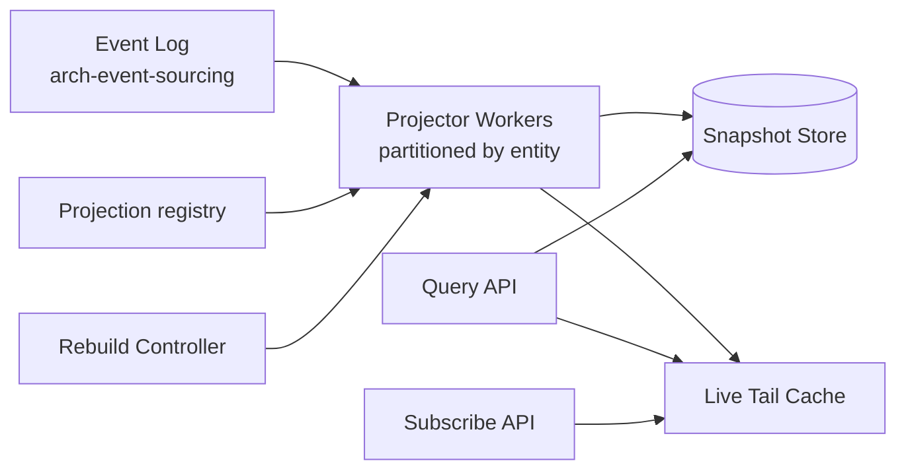

# Projection Engine

The generic **read-side projection framework** that builds queryable views from the [[arch-event-sourcing|event log]]. Used by [[arch-position-service|positions]], blotter, limit-usage counters, allocation history, surveillance pattern detectors, TCA aggregates, compliance counters, and every "current state" query across the EMS.

The pattern is repeated many times; this note formalizes the shared infrastructure so each consumer doesn't re-implement snapshot, rebuild, single-writer, and idempotency logic.

## Why a generic engine

Without one:

- Each consumer reinvents snapshot strategy → divergent freshness guarantees.
- Each rebuild reimplements idempotency → bugs.
- Cross-projection invariants (e.g. position service vs. limit service must agree on which fill they've consumed) get hard to verify.
- New consumers slow to add.

With one:

- Consumers declare a `Projection` (input event filter + reducer + snapshot schedule).
- The engine handles plumbing: subscription, ordering, snapshotting, rebuild, query API.

## Projection definition

```
Projection<S, E> {
  name              string
  version           int                     # bump on reducer changes
  partition_by      Selector<E>            # for horizontal scaling
  subscribes_to     [EventFilter]
  reducer           fn(state: S, event: E) -> S         # pure
  snapshot          { every_n_events?, every_duration? }
  initial_state     S
  state_schema      Schema                 # SBE-codegen'd
}
```

Reducers are pure. State is typed.

## Architecture



- **Projector Workers**: per-partition consumers that apply the reducer over the event log.
- **Snapshot Store**: periodic state snapshots keyed by `(projection_name, version, partition, up_to_event_id)`.
- **Live Tail Cache**: in-memory recent state for low-latency reads.
- **Query API**: snapshot + tail consumers.
- **Subscribe API**: stream of state changes for live subscribers.

## Single-writer per partition

The engine enforces single-writer-per-partition by partitioning event streams: each partition is owned by one worker. Multiple events for the same partition arrive in order; the reducer is called sequentially. Eliminates locks.

Partition selectors are projection-specific: positions partition by `(account, instrument)`; limits partition by `(scope_kind, scope_ref)`; blotter partitions by `(desk_id)`; etc.

## Snapshot strategy

Each projection declares its snapshot cadence:

- `every_n_events: 1000` — snapshot after every 1000 events processed.
- `every_duration: 5min` — snapshot every 5 minutes regardless of throughput.
- `on_event: SessionRollover` — snapshot on specific markers.

Multiple strategies compose; first one to fire triggers. Snapshots are append-only (older snapshots retained for replay until purged).

## Rebuild

A projection rebuild reprocesses the event log from scratch:

- Triggered by reducer version bump, schema migration, or operator ops.
- Runs in parallel to live projection until caught up, then atomic switch-over.
- Rebuild duration tracked; new projections are validated against the live one before switch-over.

## Idempotency

Reducers are called by `(projection_name, version, partition, event_id)`. Re-application of the same event with the same `event_id` is a no-op — the engine tracks the per-partition `last_event_id_consumed`.

## Cross-projection consistency

Projections can declare **read-after** dependencies:

```
projection limit_usage {
  read_after: [position_state]   # limit usage queries position state
  ...
}
```

Engine ensures `position_state` is at least as fresh as the event being applied to `limit_usage`. Useful for risk + compliance queries that need consistency.

## Query API

```
operation: snapshot_query
items: [{ projection, partition_key, at_event_id? }]
returns: state

operation: range_query
items: [{ projection, partition_key_range, time_range }]

operation: subscribe
items: [{ projection, filter }]
returns: stream<StateChange>
```

`at_event_id` allows point-in-time queries — useful for audit reconstruction.

## Versioning + replay

Projections are pinned to a version. A rebuild at version N+1 doesn't retroactively rewrite version N projections — they coexist. Consumers can choose which version to query (typically latest; audit may pin to historical).

## Examples in the EMS

| Projection | Partition | Reducer reads | Used by |
|---|---|---|---|
| `position_state` | `(account, instrument)` | fills, busts, corrects, corp actions | [[arch-position-service]] |
| `limit_usage` | `(scope_kind, scope_ref)` | orders, routes, fills | [[arch-validator]] / [[arch-compliance]] |
| `order_blotter` | `(desk_id)` | order events | [[order-manager]] UI |
| `route_state` | `(route_id)` | route lifecycle | [[arch-router-layer]] |
| `tca_aggregate` | `(broker, period_bucket)` | fill TCA events | [[arch-tca]] |
| `allocation_book` | `(account, period_bucket)` | allocation events | [[arch-allocation-service]] |
| `cpty_enablement_current` | `(cpty_id)` | enablement events | [[counterparty-enablement]] |
| `surveillance_window_state` | `(actor, window_key)` | order + route + fill | [[arch-surveillance]] |
| `wheel_perf_metrics` | `(strategy_id, broker, instrument_tier)` | fill TCA + selections | [[arch-smart-order-router]] |

Each was previously implemented bespoke; the engine consolidates the plumbing.

## See also

- [[arch-event-sourcing]] · [[arch-time-replay-server]] · [[arch-sbe-aeron-transport]]
- [[arch-position-service]] · [[arch-validator]] · [[arch-compliance]] · [[arch-tca]] · [[arch-surveillance]]
- [[arch-allocation-service]] · [[arch-router-layer]] · [[order-manager]]
