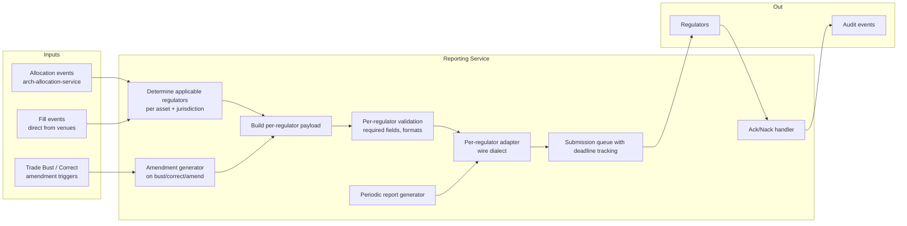
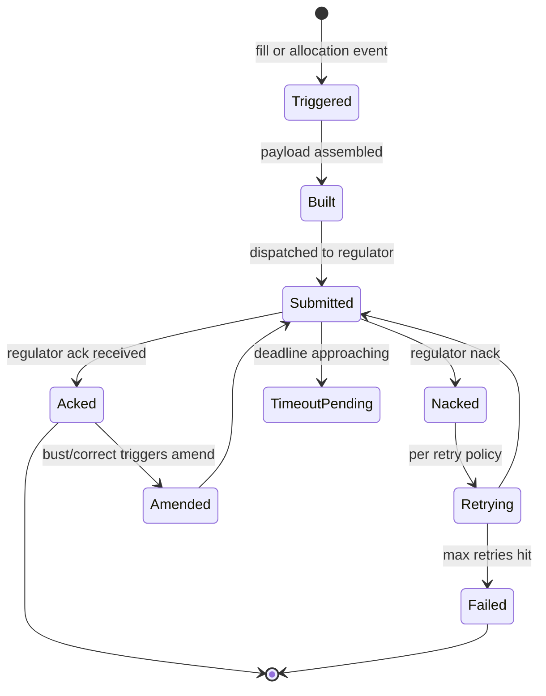

# Regulatory Reporting Service

Submits **per-trade** and **periodic** reports to regulators per jurisdiction and asset class. Handles per-regulator wire formats, deadline tracking, ack/nack lifecycle, retry policies, and amendment / cancellation reporting. Sister service to [[arch-confirmation-affirmation]]; both run downstream of [[arch-allocation-service]] in the [[arch-stp-pipeline]].

The [[regulatory-base|cross-asset workflow]] gives the workflow view; this note is the architecture.

## Regulator coverage

The service supports concurrent reporting to **all jurisdictions a firm operates in**. A single trade routinely triggers 2-4 independent reports (e.g. a London-booked IRS with a US client may report to ESMA TR via EMIR, to CFTC SDR via Dodd-Frank, and to FCA under UK MiFIR — all distinct submissions, independent deadlines, independent ack tracking).

### United States

| Regulator / report | Asset classes | Wire format | Deadline | Notes |
|---|---|---|---|---|
| [[trace\|TRACE]] (FINRA) | Corp IG/HY, agency, MBS, ABS | TRAQS, FIX TRACE dialect | 15 min of execution | Liquidity tier tagging |
| [[msrb-rtrs\|MSRB RTRS]] | Munis | RTRS web service / FIX | 15 min | |
| [[cftc-sdr\|CFTC + DTCC SDR]] | Cleared + uncleared OTC IRS, CDS, FX, comm. deriv. | DTCC SDR XML | T+0 (cleared faster) | Dodd-Frank Title VII |
| [[finra\|FINRA CAT]] | US equity, listed options | CAT JSON / FIXML | T+1 by 08:00 ET | Replaces OATS |
| OATS | US equity | (deprecated 2022) | — | Historical |
| [[ficc-reporting\|FICC]] | Cleared Treasuries, MBS TBA | FICC native | continuous | |
| [[fed-reporting\|Fed]] H.4.1, CPFF, FR Y-14, etc. | Various | various | periodic | Bank entities |
| SEC large-trader (13H) | US equity, listed options | CAT-piggyback | T+0 effectively | Beneficial owner reporting |
| CFTC Form 102 (large trader) | Futures, swaps | CFTC portal | T+1 | Position reporting |
| Reg SHO order-marking | Short equity orders | FIX OrderCapacity + 5000 | per-order | See [[arch-borrow-service]] |
| MSRB G-32 (primary muni) | Muni new issues | MSRB RTRS | per-deal | |

### European Union (post-Brexit; member states via NCAs)

| Regulator / report | Asset classes | Wire format | Deadline | Notes |
|---|---|---|---|---|
| **MiFIR RTS 22** transaction reporting | All MiFID instruments traded on EU venue or with EU-nexus | XML via ARM → NCA | T+1 (next working day) | 65+ fields incl. LEI, decision-maker, algo flags |
| **MiFIR post-trade transparency** | Equity, FI, deriv | APA (Approved Publication Arrangement) | sub-second to 2 min depending on liquidity | Public publication |
| **MiFID II RTS 27** | Per-venue execution quality reports | Quarterly publish | quarterly | Venue obligation; firm consumes |
| **MiFID II RTS 28** | Top-5 venues + execution quality | Annual publish | annual | Firm obligation; investment firm best-ex |
| **EMIR** (EMIR REFIT 2024 schema) | OTC + ETD derivatives | XML to TR (Trade Repository) | T+1 | Both sides must report; LEI mandatory; daily valuations + collateral required for OTC |
| **SFTR** | Repo, securities lending, margin lending, buy-sell-back | XML to TR | T+1 | Type/code 153 fields |
| **CSDR** (settlement discipline) | All securities settling at CSD | continuous + monthly | per cycle | Cash penalties for fails; settlement-fail prevention metrics |
| **MAR** (Market Abuse Regulation) | All listed instruments | STORs (Suspicious Transaction & Order Reports) to NCA | "without delay" | Surveillance-driven, see [[arch-surveillance]] |
| **AIFMD Annex IV** | Funds | XML to NCA | quarterly | Asset manager reporting |
| **PRIIPs KIDs** | Retail packaged products | KID document | pre-trade | Not a report per se but a disclosure |
| **CSDR Article 7** mandatory buy-in | Failed settlements | bilateral | per fail + period | Currently suspended; conditional reactivation |

### United Kingdom (post-Brexit)

| Regulator / report | Asset classes | Wire format | Deadline | Notes |
|---|---|---|---|---|
| **UK MiFIR transaction reporting** | All UK-MiFID instruments | XML via ARM → FCA | T+1 | Mirrors EU MiFIR; UK-specific ARMs |
| **UK MiFIR post-trade transparency** | Equity, FI, deriv | UK APA | sub-second to 2 min | |
| **UK EMIR** | OTC + ETD | XML to UK TR | T+1 | Diverging from EU EMIR over time |
| **UK SFTR** | SFTs | XML to UK TR | T+1 | |
| **FCA SMCR** (Senior Managers + Certification Regime) | — | personal accountability | — | Not a report but compliance-system implication |

### Asia-Pacific

| Regulator / report | Jurisdiction | Notes |
|---|---|---|
| **HKEX OMD** + **SFC OTC** | Hong Kong | HKEX market-data; SFC OTC derivatives reporting via HKTR |
| **MAS** (Singapore) | Singapore | OTC derivatives reporting per SFA Part VIA; MAS Notice SFA 04-N15 |
| **JFSA** + **JSDA** | Japan | OTC deriv reporting; J-GAAP-aware; JPX OMD market data |
| **ASIC** | Australia | OTC derivatives transaction reporting; ASIC RG 251 |
| **CSRC** + **Stock Connect** | China | Northbound/Southbound Connect specifics; daily quota; investor ID |
| **FSC** (Korea) | South Korea | KRX market reporting + OTC IRS reporting |
| **SEBI** | India | Investor protection + market reporting |

### Cross-Border (tax + sanctions)

| Regime | Type | Notes |
|---|---|---|
| **FATCA** (US) | Tax withholding + reporting | W-8/W-9 capture; account-level reporting |
| **CRS** (OECD) | Tax automatic exchange | Account-level reporting per residency |
| **OFAC** (US sanctions) | Pre-trade screening | Sanctioned-party screening on every counterparty |
| **EU sanctions** (CFSP) | Pre-trade screening | Mirrored screening process |
| **UN sanctions** | Pre-trade screening | Global baseline |
| **AML / KYC** (FinCEN, EU AMLD) | Account onboarding + monitoring | Drives KYC freshness requirements (see [[arch-compliance]]) |

### Concurrent multi-jurisdiction reporting

A single trade may be reportable to multiple regulators **independently**. Example: a USD interest-rate swap booked in London, between a US-bank entity and an EU-asset-manager client:

```
applicable_regulators(trade) = [
  CFTC_SDR,           # US Dodd-Frank
  EMIR_TR,            # EU client; both-sided reporting
  UK_EMIR_TR,         # UK booking entity
  FCA_RTS22,          # UK MiFIR transaction reporting
  ESMA_RTS22          # via client's MiFIR obligation (firm acts as transmitting firm)
]
```

Each is an independent `RegReportTriggered` event with its own deadline, retry policy, and ack tracking. Failure of one does not affect the others.

## Architecture



## Determination logic

A lookup table keyed by `(asset_class, instrument, jurisdiction, firm_registration)`:

```
applicable_regulators(trade) =
  for each (regulator, condition) in matrix:
    if condition.matches(trade): emit regulator
```

A single trade can be reportable to multiple regulators (e.g. a cross-border equity trade may report to both US FINRA and EU MIFIR). Each is independent.

## Per-trade reporting lifecycle



## Per-regulator config

```
ReportingProfile {
  regulator_id, wire_format, endpoint
  deadline { from_event, max_latency }
  required_fields                  # per asset class
  ack_timeout, retry_policy
  amendment_protocol               # void-and-replace vs amend-in-place
  cancellation_protocol
  test_endpoint                    # for staging
}
```

Profiles are reference data; updates are versioned with sign-off (regulatory specifications change periodically).

## Required-field validation

Before submission, the validator ensures every field the regulator requires is present:

```
required_fields_for(TRACE, IG corp bond) = [
  trace_party_id, cusip_or_isin, executing_broker,
  contra_party_id (or "C" for customer),
  side, qty, price, yield, trade_date, settle_date,
  trade_modifiers (when-issued, special-cash, etc.)
]
```

Missing field → `RegReportDeferred` until the field is resolved (e.g. counterparty LEI lookup completes). Allocation-time fields blocked early; venue-time fields may arrive later.

## Amendment / void reporting

For [[arch-fix-appendix-d|Trade Bust]] and [[arch-fix-appendix-d|Trade Correct]]:

- **Void-and-replace** (most regulators): submit a cancellation referencing the original, then a new submission with corrected fields.
- **Amend-in-place** (rare): submit an amendment record.

Per-regulator protocol selected from `ReportingProfile.amendment_protocol`. The service tracks the chain: `Original Submitted → Acked → Voided → Replacement Submitted → Acked`.

## Deadline tracking

Each report has a deadline computed from the event timestamp + regulator's max latency. The service:

- Schedules a deadline alert.
- Emits `RegReportLate` if approaching deadline.
- Escalates to ops via [[arch-notification-service]] if the report won't make the deadline.

Late reports are themselves a compliance issue — both internally and externally; some regimes fine for late reporting.

## Periodic reports

Some regulators require aggregate periodic reports. The service runs them as scheduled jobs pulling from event log + projections:

| Periodic report | Frequency | Source |
|---|---|---|
| MiFID II RTS 27 (venue exec quality) | quarterly | venue is obligor; firm consumes |
| MiFID II RTS 28 (firm top-5 venues + best-ex) | annual | per asset class per client class |
| EMIR daily valuation report | daily | OTC derivative MTM + collateral |
| EMIR collateral report | daily | per portfolio |
| CSDR settlement-discipline metrics | monthly | settlement-fail rates per CSD |
| SFTR position reports | weekly | open SFT positions |
| CFTC Form 102 | T+1 reportable position thresholds | position service |
| Form PF (US private fund advisers) | quarterly / annual | fund-level positions + leverage |
| AIFMD Annex IV | quarterly | EU funds |
| FATCA / CRS account reports | annual | account master |
| Fed FR Y-14 (large bank) | quarterly | bank entity |
| JFSA OTC reporting summaries | monthly | Japan OTC |

Each periodic report has its own builder. Some pull from [[arch-tca]] aggregates (RTS 27/28), some from [[arch-position-service]] (Form 102, Form PF), some from [[arch-allocation-service]] (collateral). All flow through the same submission pipeline.

## Replay determinism

Reporting decisions (which regulator, what fields, what format) are pure functions of (trade + profile version). [[arch-time-replay-server|Replay]] sandboxes outbound submissions; the would-be wire bytes are deterministic.

## Events

```
RegReportTriggered { report_id, triggered_by_event, regulator, deadline }
RegReportBuilt { report_id, payload_hash }
RegReportSubmitted { report_id, submitted_at }
RegReportAcked { report_id, regulator_ack_ref }
RegReportNacked { report_id, error_code, retry_schedule }
RegReportFailed { report_id, after_n_retries }
RegReportAmended { original_report_id, amendment_report_id, reason }
RegReportVoided { original_report_id, void_report_id, reason }
RegReportLate { report_id, deadline, current_state }
```

## Where this service ends and others begin

The reporting service handles **submission, deadline tracking, ack/nack, amendment**. It does **not** handle:

- **Pre-trade transparency** (MiFIR pre-trade publication, SI quote publication): tied to [[arch-quote-server]] + venue connectivity for outbound quote publication via APA.
- **Sanctions / OFAC screening**: a pre-trade check inside [[arch-compliance]] (block-with-override).
- **STOR / suspicious activity reports**: lives in [[arch-surveillance]] — those reports are filed but originate from surveillance alerts.
- **Best-ex policy demonstration**: the policy compliance is in [[arch-tca]] + [[arch-jurisdictional-compliance]]; the *report* (RTS 27/28) is submitted by this service.
- **Order record keeping** (5-year minimum under MiFID II, 7-year SEC, etc.): handled by [[arch-event-sourcing]] retention policies.
- **Trader certification, phone recording, clock synchronization (RTS 25)**: not reports — system requirements documented in [[arch-jurisdictional-compliance]].

See [[arch-jurisdictional-compliance]] for the full per-jurisdiction matrix of non-reporting obligations.

## See also

- [[regulatory-base]] · [[stp-summary]] · [[arch-stp-pipeline]] · [[arch-allocation-service]]
- [[arch-jurisdictional-compliance]] (non-reporting obligations per jurisdiction)
- [[arch-event-sourcing]] · [[arch-time-replay-server]] · [[arch-notification-service]]
- [[arch-compliance]] (sanctions screening) · [[arch-surveillance]] (STORs) · [[arch-tca]] (RTS 27/28 source)
- [[trace]] · [[msrb-rtrs]] · [[cftc-sdr]] · [[finra]] · [[ficc-reporting]] · [[fed-reporting]] · [[dtcc-sdr]]
- [[arch-symbology-figi]] · [[counterparty-enablement]] · [[arch-fix-appendix-d]]
