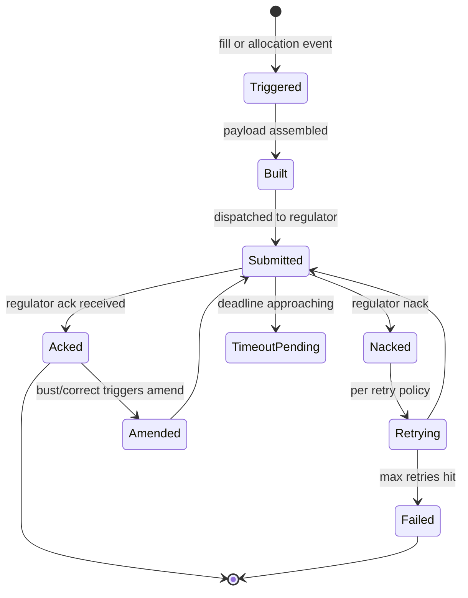

# Regulatory Reporting Service

Submits **per-trade** and **periodic** reports to regulators per jurisdiction and asset class. Handles per-regulator wire formats, deadline tracking, ack/nack lifecycle, retry policies, and amendment / cancellation reporting. Sister service to [[arch-confirmation-affirmation]]; both run downstream of [[arch-allocation-service]] in the [[arch-stp-pipeline]].

The [[regulatory-base|cross-asset workflow]] gives the workflow view; this note is the architecture.

## Regulator coverage

| Regulator / report | Asset classes | Wire format | Deadline |
|---|---|---|---|
| [[trace\|TRACE]] (FINRA) | Corp IG/HY, agency, MBS | TRAQS, FIX TRACE dialect | within 15 min of execution |
| [[msrb-rtrs\|MSRB RTRS]] | Munis | RTRS web service / FIX | within 15 min |
| [[cftc-sdr\|CFTC + DTCC SDR]] | Cleared OTC IRS, CDS | DTCC SDR format | T+0 |
| [[finra\|FINRA OATS / CAT]] | US equity | CAT JSON / OATS | T+0 8am next day for CAT |
| [[ficc-reporting\|FICC]] | Cleared Treasuries, MBS | FICC native | continuous |
| [[fed-reporting\|Fed]] | H.4.1, CPFF, etc. | various | periodic |
| MIFIR transaction reporting (EU) | Equity, FI, deriv (EU-nexus) | XML to NCA | T+1 |
| EMIR (EU OTC deriv) | OTC deriv | XML to TR | T+1 |
| HKEX OMD, MAS, etc. | Asian regimes | various | various |

## Architecture

```mermaid
flowchart LR
  subgraph Inputs
    E[Allocation events<br/>[[arch-allocation-service]]]
    F[Fill events<br/>direct from venues]
    T[Trade Bust / Correct<br/>amendment triggers]
  end

  subgraph "Reporting Service"
    DT[Determine applicable regulators<br/>per asset + jurisdiction]
    BLD[Build per-regulator payload]
    VLD[Per-regulator validation<br/>required fields, formats]
    ADAP[Per-regulator adapter<br/>wire dialect]
    QUE[Submission queue with deadline tracking]
    AK[Ack/Nack handler]
    AMD[Amendment generator<br/>on bust/correct/amend]
    RPT[Periodic report generator]
  end

  subgraph Out
    REGS[Regulators]
    EV[Audit events]
  end

  E --> DT
  F --> DT
  T --> AMD
  DT --> BLD
  BLD --> VLD
  VLD --> ADAP
  ADAP --> QUE
  QUE --> REGS
  REGS --> AK
  AK --> EV
  AMD --> BLD
  RPT --> ADAP
```

## Determination logic

A lookup table keyed by `(asset_class, instrument, jurisdiction, firm_registration)`:

```
applicable_regulators(trade) =
  for each (regulator, condition) in matrix:
    if condition.matches(trade): emit regulator
```

A single trade can be reportable to multiple regulators (e.g. a cross-border equity trade may report to both US FINRA and EU MIFIR). Each is independent.

## Per-trade reporting lifecycle



## Per-regulator config

```
ReportingProfile {
  regulator_id, wire_format, endpoint
  deadline { from_event, max_latency }
  required_fields                  # per asset class
  ack_timeout, retry_policy
  amendment_protocol               # void-and-replace vs amend-in-place
  cancellation_protocol
  test_endpoint                    # for staging
}
```

Profiles are reference data; updates are versioned with sign-off (regulatory specifications change periodically).

## Required-field validation

Before submission, the validator ensures every field the regulator requires is present:

```
required_fields_for(TRACE, IG corp bond) = [
  trace_party_id, cusip_or_isin, executing_broker,
  contra_party_id (or "C" for customer),
  side, qty, price, yield, trade_date, settle_date,
  trade_modifiers (when-issued, special-cash, etc.)
]
```

Missing field → `RegReportDeferred` until the field is resolved (e.g. counterparty LEI lookup completes). Allocation-time fields blocked early; venue-time fields may arrive later.

## Amendment / void reporting

For [[arch-fix-appendix-d|Trade Bust]] and [[arch-fix-appendix-d|Trade Correct]]:

- **Void-and-replace** (most regulators): submit a cancellation referencing the original, then a new submission with corrected fields.
- **Amend-in-place** (rare): submit an amendment record.

Per-regulator protocol selected from `ReportingProfile.amendment_protocol`. The service tracks the chain: `Original Submitted → Acked → Voided → Replacement Submitted → Acked`.

## Deadline tracking

Each report has a deadline computed from the event timestamp + regulator's max latency. The service:

- Schedules a deadline alert.
- Emits `RegReportLate` if approaching deadline.
- Escalates to ops via [[arch-notification-service]] if the report won't make the deadline.

Late reports are themselves a compliance issue — both internally and externally; some regimes fine for late reporting.

## Periodic reports

Some regulators require aggregate periodic reports (e.g. MiFID II RTS 27 quarterly best-ex). These are scheduled jobs:

- Pull data from event log + projections (e.g. TCA aggregates).
- Format per regulator.
- Submit on schedule.
- Track ack.

## Replay determinism

Reporting decisions (which regulator, what fields, what format) are pure functions of (trade + profile version). [[arch-time-replay-server|Replay]] sandboxes outbound submissions; the would-be wire bytes are deterministic.

## Events

```
RegReportTriggered { report_id, triggered_by_event, regulator, deadline }
RegReportBuilt { report_id, payload_hash }
RegReportSubmitted { report_id, submitted_at }
RegReportAcked { report_id, regulator_ack_ref }
RegReportNacked { report_id, error_code, retry_schedule }
RegReportFailed { report_id, after_n_retries }
RegReportAmended { original_report_id, amendment_report_id, reason }
RegReportVoided { original_report_id, void_report_id, reason }
RegReportLate { report_id, deadline, current_state }
```

## See also

- [[regulatory-base]] · [[stp-summary]] · [[arch-stp-pipeline]] · [[arch-allocation-service]]
- [[arch-event-sourcing]] · [[arch-time-replay-server]] · [[arch-notification-service]]
- [[trace]] · [[msrb-rtrs]] · [[cftc-sdr]] · [[finra]] · [[ficc-reporting]] · [[fed-reporting]] · [[dtcc-sdr]]
- [[arch-symbology-figi]] · [[counterparty-enablement]] · [[arch-fix-appendix-d]]
