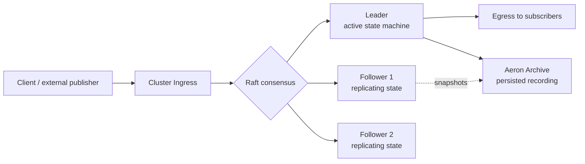

# 24/7 Resilience & Hot-Warm Continuity

The EMS must operate under **continuous markets** (crypto 24/7/365, FX 24/5, futures 23-hour Globex) and **support planned power-cycling** (deploys, patching, kernel upgrades, region failover) without dropping a single message or breaking a single trace. This note formalizes the operational continuity model and how it leverages [[arch-sbe-aeron-transport|Aeron]]'s cluster + archive + replay primitives.

## The continuity guarantees

1. **Zero message loss** across planned restart of any single component.
2. **Sub-second failover** of leader to hot-warm replica on unplanned failure.
3. **Position-precise recovery** from cold start using the Aeron Archive + event log.
4. **Continuous trading windows** preserved per asset class:
   - **Crypto**: never an unattended down period. Funding-rate settlement (every 8h on most venues) must not skip.
   - **FX**: 24/5 — Sun 17:00 NY → Fri 17:00 NY. Cross-region failover during weekday handoffs.
   - **Futures (CME / EUREX / etc.)**: 23-hour Globex; the 1-hour daily pause is the only safe maintenance window.
   - **Equity (regional)**: maintenance during regional closed hours.
   - **FI**: bilateral hours; some always-on (repo).

## Asset-class maintenance windows

```mermaid
gantt
    title Maintenance windows by asset class (NY time)
    dateFormat HH:mm
    axisFormat %H:%M

    section Crypto
    NO WINDOW (rolling only)        :crit, 00:00, 24h

    section FX
    Weekend window Fri 17:00 - Sun 17:00   :ok, 00:00, 48h

    section Futures (CME)
    Daily pause 17:00 - 18:00       :ok, 17:00, 1h

    section US Equity
    After-close 16:00 - 09:30 (next) :ok, 16:00, 17h
```



Per-asset operational planning lives in [[arch-reference-data-service|reference data]] and is consulted by ops before any planned restart.

## Continuity tiers

| Tier | Use | RTO | RPO |
|---|---|---|---|
| **Hot active** | live serving | 0 | 0 |
| **Hot follower** | live replica taking the same input stream | < 1s on promotion | 0 |
| **Warm standby** | running but not consuming live stream; catches up via Archive replay on promotion | seconds to minutes | 0 (Archive replay) |
| **Cold standby** | not running; brought up from snapshot + Archive | minutes | 0 |
| **Archive only** | recorded history for replay and audit | hours | 0 (full replay capable) |

Every component declares its required tier in its deployment manifest. For example:

- **Order layer**: hot active + 2 hot followers + 1 cross-region warm.
- **Validator**: hot active + 2 hot followers (stateless except for rate-limit counters).
- **Surveillance**: warm + replay capable (post-trade tolerance).
- **TCA aggregator**: warm (eventual consistency is fine).

## Aeron Cluster — the spine

Critical state-machine components run as **Aeron Cluster** nodes (Raft-based consensus):



Key properties:

- **Replicated state machine.** Same deterministic FSM (see [[arch-fix-fsm-design]]) runs on every node. Followers apply the same events in the same order; their derived state is byte-identical to the leader's.
- **Quorum commits.** A message is committed only when a Raft quorum acknowledges — eliminates split-brain.
- **Snapshotting.** Each cluster node periodically snapshots its state to its local Archive. Snapshots include current position in the recorded stream; on restart, a node loads the latest snapshot then replays from that position to catch up.
- **Election.** On leader failure, followers run an election (Raft); a new leader is chosen within typical sub-second timing. Egress is paused momentarily; clients see a brief retry, no data loss.

The components that benefit most:

- **Order Layer** ([[arch-order-staged]])
- **Router** ([[arch-router-layer]])
- **AAA / Session Layer** ([[entry-point-aaa]] + [[arch-sequence-recovery]])
- **Compliance** ([[arch-compliance]]) — at least its synchronous gate
- **Allocation Service** ([[arch-allocation-service]])
- **Position Service** ([[arch-position-service]]) — projection rebuild from Archive on cold start

## Aeron Archive — record everything, replay anywhere

Aeron Archive records all live streams to disk with **position-precise** indices:

- Every event has a `(stream, position)` coordinate.
- Replay from any position is supported — second-precise, message-precise.
- Archive segments rotate by size/time; older segments can be tiered off (S3 etc.).
- The Archive is the **transport-layer companion** to [[arch-event-sourcing|the application event log]] — both serve replay; the Archive is faster (no application decode) and the event log is more semantically rich.

A warm or cold standby promotion sequence:

```
1. Load latest snapshot from local or shared storage
2. Compute snapshot.position (last applied event in the recorded stream)
3. Open Archive replay from snapshot.position to current live tail
4. Apply replayed events deterministically
5. When caught up, join live stream and accept leadership / serve traffic
```

This is the same machinery used for [[arch-time-replay-server|replay verification]] and [[arch-best-execution|audit reconstruction]].

## Rolling restart — the routine ops pattern

Used for: deploys, kernel patching, dependency upgrades, hardware refresh.

```mermaid
sequenceDiagram
  participant L as Current Leader
  participant F1 as Follower 1
  participant F2 as Follower 2
  participant OPS as Ops Console

  OPS->>L: drain + step down
  L->>L: snapshot current state
  L-->>OPS: snapshot complete
  L->>F1: hand over leadership (Raft transfer)
  Note over F1: F1 is now leader<br/>L is now follower
  OPS->>L: stop process; deploy new binary
  L->>L: start fresh; load snapshot; replay tail
  L->>F1: rejoin cluster as follower
  Note over L: caught up; eligible for leadership
  OPS->>F1: drain + step down
  F1->>F2: hand over leadership
  Note over F2: F2 now leader
  Note over OPS: continue for F2 and beyond
```

Per node: ~30s drain + ~10s snapshot + restart + ~10s replay catchup = under a minute. With 3 nodes, full cluster rotation ~3 minutes. **Zero message loss; zero perceived client outage** beyond the sub-second leadership transitions.

The drain step is critical: the outgoing leader must let in-flight commits land in the quorum before stepping down. Aeron Cluster's leadership-transfer RPC handles this.

## Hot-warm failover — unplanned

On unplanned leader failure (process crash, host failure, network partition):

1. Followers stop receiving heartbeats from leader.
2. After `election_timeout` (typically 150–300 ms), a follower starts an election.
3. Quorum elects a new leader.
4. New leader resumes serving from the last committed position.
5. Clients reconnect; their per-session sequence numbers ([[arch-sequence-recovery]]) handle any in-flight retransmits without loss.

Total RTO: typically < 1 second for the cluster; client perceived RTO depends on client reconnect logic.

## Cross-region active-passive

For global firms operating multiple regions (NY / LDN / TYO / HKG), each region runs its own cluster. Active-active is **possible** but introduces eventual-consistency considerations that conflict with FIX's deterministic ordering — most firms prefer **active-passive**:

- One region is **primary** for a given client / desk / asset class.
- The other regions hold **warm replicas** that consume the primary's Archive stream and apply events.
- On region failover: warm replica's state is up-to-date (modulo replication lag, typically < 1s on a healthy link). Promotion is an explicit ops decision.

Per-asset-class routing: crypto might be NY-primary always; FX might rotate NY → LDN → TYO with the time zones; equity is regional-only.

## Snapshot and recording management

- **Snapshot cadence**: per-component, typically every 10k events or every 5 minutes (whichever comes first).
- **Snapshot retention**: keep last N (e.g. 100); older purged once Archive segments are tiered.
- **Archive retention**: hot tier on local NVMe for 24–72h; warm tier on networked storage for ~30 days; cold tier on object storage (S3 / Azure Blob) for the long-tail retention dictated by [[arch-jurisdictional-compliance|jurisdictional requirements]] (5y MiFID II, 7y SEC, etc.).

## Continuity verifies — practice the drills

Continuity isn't a property you write down; it's a property you **test**:

- **Weekly leader-kill drill** in staging: verify sub-second election + zero replay diff.
- **Monthly cold-start drill** in staging: verify snapshot + Archive replay catches up.
- **Quarterly region failover drill**: verify warm replica promotion.
- **Annual full-disaster drill**: bring up a cluster from cold archives only, replay full day, verify byte-identical output via [[arch-time-replay-server|golden replay]].

All drills are scripted; results recorded as events on the ops audit stream.

## Integration with the rest of the architecture

| Concern | How resilience addresses it |
|---|---|
| FIX session continuity | [[arch-sequence-recovery]] handles client-side gap recovery on leader failover. The new leader has the same session state because it was a Raft follower. |
| Trace continuity | [[arch-observability]] trace IDs flow through the cluster; spans created on the old leader, finished on the new — supported by W3C trace context. |
| Identity chaining | [[arch-identity-chaining|`initial_*` IDs]] survive failover trivially (they're in the replicated state). |
| Replay determinism | [[arch-event-sourcing|Event sourcing]] + [[arch-time-replay-server|simulated clock]] + Aeron Archive position-precise replay = same input bytes → same output state on any node, any restart. |
| Compliance audit trail | Archive + event log preserved across all restarts and failovers. |
| Asset-class scheduling | Maintenance windows enforced from [[arch-reference-data-service|reference data]]; ops console refuses ill-timed restarts. |
| Window-aware config changes | [[arch-configuration-service]] consults the same window table — risk-limit loosening and validator rule changes are blocked outside maintenance windows by default; emergency override requires a fourth-signature tag. |

## Anti-patterns

- **Pulling a node from the cluster during a market session without rolling leader transfer.** Even if Raft survives, in-flight commits can stall.
- **Running production traffic through a single-node cluster.** No quorum = no continuity. Minimum 3 nodes (tolerate 1 failure) or 5 (tolerate 2). Even for low-volume desks.
- **Sharing Archive storage across clusters without isolation.** A failed snapshot of cluster A can corrupt cluster B's archive directory layout. One Archive per cluster, period.
- **Reusing cluster nodes across asset classes with very different load profiles.** A spike in crypto can starve the equity cluster's quorum acks. Run separate clusters per asset class (or per region) where load profiles differ materially.
- **"24/7 means we never restart."** No — 24/7 means we restart **continuously and invisibly**. Avoiding restart is how systems rot.

## See also

- [[arch-sbe-aeron-transport]] (Aeron primitives — Cluster, Archive, Replay)
- [[arch-event-sourcing]] · [[arch-time-replay-server]] · [[arch-fix-fsm-design]] (deterministic state machine)
- [[entry-point-aaa]] · [[arch-sequence-recovery]] (session continuity)
- [[arch-observability]] · [[arch-identity-chaining]] (trace + chain survive failover)
- [[arch-jurisdictional-compliance]] (retention) · [[arch-reference-data-service]] (asset-class calendars)
- [[arch-position-service]] · [[arch-allocation-service]] · [[arch-router-layer]] · [[arch-order-staged]]
- [[crypto-spot]] · [[crypto-perpetual]] (24/7 examples) · [[fx-spot]] · [[equity-futures]]
