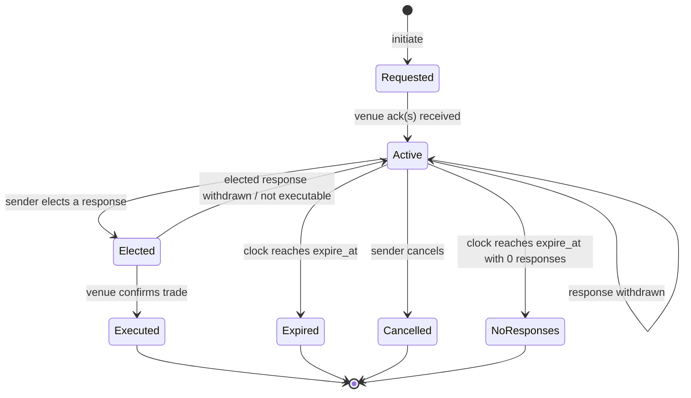

# RFQ — Request For Quote (Architecture)

RFQ as a **first-class architectural component**, not just a routing mode. RFQs span asset classes (FX, FI corp, muni, equity blocks and ETFs, OTC derivatives, MBS TBA) with very different microstructure but a shared underlying lifecycle. This note defines the canonical RFQ model that the [[route-to-rfq|RFQ workflow]] and [[multi-route-rfq|multi-RFQ workflow]] both build on.

## Why architecturally distinct

RFQ has unique properties versus CLOB / algo routing:

- **Bilateral / N-ary negotiation** — sender solicits N dealers; each responds independently.
- **Time-bound responses** — quotes have explicit `valid_until`; expiry is a first-class event.
- **Election step** — sender picks one (or multiple) winning responses.
- **Quote-quality discrimination** — last-look, fading, stale quotes, "in touch with" responses, "subject" responses.
- **Counterparty intelligence** — performance feedback per dealer feeds future RFQ panel construction.
- **Asset-class variation** — FX RFQ is sub-second; corp bond RFQ is minutes; muni BWIC RFQ is hours.

A unified architectural component absorbs all this; per-asset-class workflows are thin overlays.

## Canonical RFQ data model

```
RFQ {
  rfq_id                       UUID
  initiated_by                 Identity
  initiated_at                 timestamp
  rfq_kind                     SINGLE_DEALER | MULTI_DEALER | ANONYMOUS_A2A |
                               BWIC | OWIC | LIST_RFQ | PORTFOLIO_RFQ
  instrument                   FIGI                  # or list of FIGIs for LIST/PORTFOLIO
  side                         BUY | SELL | TWO_WAY
  qty                          decimal
  qty_type                     FIRM | UP_TO | ALL_OR_NONE
  desired_response_format      PRICE | YIELD | SPREAD | NAV_BASED       # FI / ETF
  ioi_link?                    IoiRef                # see [[arch-ioi]]
  dealers_invited              [DealerRef]
  ext_attributes               map<string, any>     # per-venue extensions

  state                        REQUESTED | ACTIVE | EXPIRED | ELECTED |
                               EXECUTED | CANCELLED | NO_RESPONSES

  expire_at                    timestamp
  min_responses_to_proceed?    int
  partial_ok                   bool

  responses                    [QuoteResponse]
  elected_response_id?         UUID
  executed_at?                 timestamp

  metadata                     { venue_routes: [...], parent_order: order_id }
}

QuoteResponse {
  response_id                  UUID
  rfq_id                       UUID
  dealer                       DealerRef
  via_venue                    VenueRef
  received_at                  timestamp
  price                        decimal           # or yield/spread per desired_response_format
  qty                          decimal           # may differ from RFQ qty
  qualifier                    FIRM | INDICATIVE | SUBJECT | LAST_LOOK | IN_TOUCH_WITH
  valid_until                  timestamp
  axe?                         IoiRef            # if response references a NATURAL IOI
  attributes                   map<string, any>
}
```

## State machine



Note `Elected → Active` if the elected response turns out un-executable (stale, fading, last-look-fail) — the RFQ remains live for the sender to elect another. This is critical for "last look" venues.

## Per-asset-class variants

The canonical model handles each by parameter choices:

| Asset class | rfq_kind typical | qty_type | response_format | expire_at typical | venue examples |
|---|---|---|---|---|---|
| FX spot/forward | MULTI_DEALER / SINGLE_DEALER | FIRM | PRICE | 1-10s | FXConnect, BBG ALLQ, FX RFQ on Tradeweb |
| FX swap | MULTI_DEALER | FIRM | PRICE (forward points) | 1-30s | FXConnect, FX swap RFQ |
| Corp IG / HY | MULTI_DEALER / A2A | FIRM | PRICE or SPREAD | 30s-5m | MarketAxess, Tradeweb, BBG ALLQ |
| Muni | BWIC / OWIC list | FIRM | PRICE | hours | BBG BWIC, MuniCenter |
| Govt | MULTI_DEALER | FIRM | YIELD or PRICE | sec-min | Tradeweb, BBG FIT |
| IRS / CDS | MULTI_DEALER | FIRM | PRICE | sec-min | SEF platforms |
| TBA (MBS) | MULTI_DEALER | FIRM | PRICE | min | BBG TBA, Tradeweb |
| Equity block | SINGLE / MULTI | FIRM, AON | PRICE | 10s-1min | block ATS, Liquidnet |
| **Equity ETF block** | MULTI_DEALER | FIRM, AON | PRICE or NAV_BASED | 10s-2min | Tradeweb iETF, BBG ETF RFQ, MarketAxess Open Trading for ETFs |
| Convertibles | SINGLE / MULTI | FIRM | PRICE | min | dealer voice + electronic |

### Equity ETF RFQ specifics

ETF RFQ (Tradeweb iETF, BBG, MarketAxess) is a fast-growing space:

- **Block size** that's hard to execute on lit equity markets without impact.
- **NAV-based response** (`response_format=NAV_BASED`) is offered by some platforms — dealer commits to a price relative to end-of-day iNAV, useful for risk-transfer trades.
- **Authorized Participant (AP) workflow** — for large blocks, the dealer may create/redeem ETF units against the underlying basket. RFQ metadata can carry `ap_workflow_hint` so the response is constructed appropriately.
- **iNAV reference** — pulled from [[arch-realtime-analytics|iNAV benchmark]] for fair-price reasoning and TCA decomposition.
- **Settlement** — normal equity DVP (T+1 in US post-2024). No exotic settlement.
- **Reg context** — under MiFID II, ETF RFQ is one of the categories of OTF / SI workflows; pre-trade transparency rules apply.

## Pluggable venue adapters

Each RFQ venue is a [[arch-venue-connectivity|venue adapter]] supporting the RFQ capability:

```
adapter.capabilities = { SUPPORTS_RFQ: true,
                         supported_rfq_kinds: [MULTI_DEALER, A2A, ...],
                         supported_response_formats: [PRICE, SPREAD, ...] }
```

The RFQ service's job:

1. Receive the canonical RFQ envelope.
2. Identify which adapters can serve it.
3. Dispatch to each via the adapter's RFQ encoding (FIX `35=R`, proprietary REST, etc.).
4. Normalize responses back to canonical `QuoteResponse`.
5. Distribute to subscribers (the trader UI, automation, validator for limit-vs-quote sanity).
6. Handle election by routing to the chosen response's venue + dealer.

## Multi-RFQ / cross-venue

The [[multi-route-rfq|multi-RFQ workflow]] is just `rfq_kind=MULTI_DEALER` with `dealers_invited` spanning multiple venues. The service fans out per venue, aggregates responses on a single topic, and presents a union.

## Integration with IOI

When an IOI ([[arch-ioi]]) is present that matches an outgoing RFQ:

- The RFQ can carry `ioi_link` referencing the original `IoiRef`.
- The targeted dealer's response may include `axe: IoiRef` linking the quote back to the IOI.
- TCA can show "this trade was initiated from IOI X and executed via dealer Y" — full provenance.

## Integration with SOR

The [[arch-smart-order-router|SOR]] can dispatch RFQs as child routes. A SOR strategy might:

- For small qty: route to CLOB.
- For block qty: send RFQ to a curated panel.
- For ETF block: choose between iNAV-based RFQ and CLOB slicing based on iNAV spread.

Each strategy decision logged for best-ex.

## Permission scopes

- `#cpty-{venue}` per RFQ venue (3-layer per [[arch-tag-permissions]]).
- `#cpty-{dealer}` per dealer in the panel (some firms restrict).
- `#rfq-bwic-list` for OWIC/BWIC participation (different liability profile).
- `#etf-rfq-block` for ETF block RFQ size tiers.

## Audit / Best-Ex

Every RFQ is fully event-sourced. For best-ex audit:

- **Panel selection rationale** — who was invited and why (firm panel policy + tier).
- **Every received response** — including non-winners.
- **Election rationale** — best price? or other (liquidity, dealer relationship, IOI link)?
- **Performance feedback** — per-dealer response rate, hit rate, slippage vs election.

Feeds [[arch-tca]] and the [[arch-smart-order-router|algo wheel]] performance projections.

## Anti-patterns

- **RFQ as just a routing mode without first-class state.** Loses election visibility, multi-response audit, expiry handling.
- **Mixing FIRM and INDICATIVE responses in display without labels.** Trader thinks INDICATIVE is executable.
- **Hardcoded per-venue RFQ logic in callers.** Venue adapters absorb the variation.
- **Ignoring last-look fades for performance metrics.** A dealer with a "good price" that fades 30% of the time is not a good dealer; metrics must include execution rate.
- **Treating ETF RFQ as ordinary equity.** NAV-based pricing, AP workflows, and iNAV references are distinct.

## API surface

```
operation: initiate_rfq
items: [{ instrument, side, qty, dealers, expire_in, rfq_kind, format, ioi_link?, partial_ok }]

operation: cancel_rfq
items: [{ rfq_id }]

operation: elect_quote
items: [{ rfq_id, response_id, qty }]

operation: subscribe_rfq(filter) -> stream<RfqEvent>

operation: query_rfq_history(filter)
```

## See also

- [[arch-router-layer]] · [[arch-venue-connectivity]] · [[arch-quote-server]] · [[arch-smart-order-router]]
- [[arch-ioi]] · [[arch-realtime-analytics]] (iNAV) · [[arch-tca]]
- [[arch-event-sourcing]] · [[arch-validator]] · [[arch-compliance]] · [[arch-tag-permissions]]
- [[route-to-rfq]] · [[multi-route-rfq]] · [[bloomberg-bwic-owic]] · [[bloomberg-tba]] · [[bloomberg-rfqe]] (ETF RFQ)
- [[marketaxess]] · [[tradeweb]] · [[bloomberg-bridge]] · [[trumid]] · [[neptune]] (pre-trade axes) · [[sef-platforms]] · [[bloomberg-sef]]
- [[bloomberg-allq]] · [[bloomberg-fit]] (price-discovery screens — observed, not routed to)
