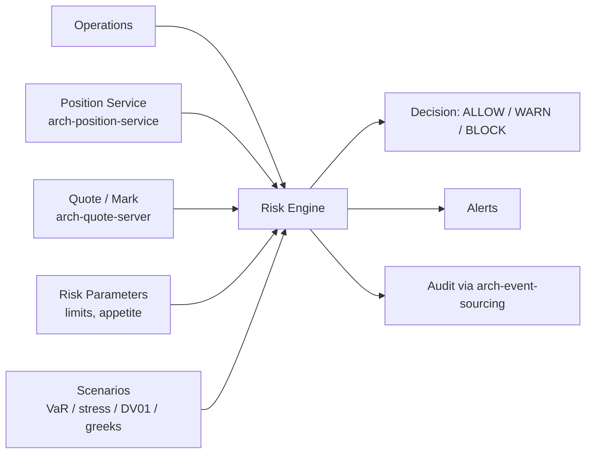

# Risk Engine

Pre-trade and continuous **position-aware risk checks**. Sister to [[arch-compliance|Compliance]] and to [[arch-validator|Validation]], distinguished by what it computes and what it returns:

| Property | [[arch-validator\|Validation]] | [[arch-compliance\|Compliance]] | Risk |
|---|---|---|---|
| Question | "Well-formed and permitted?" | "Should this happen given everything we know?" | "What's the position/P&L impact and is it within risk appetite?" |
| Decision | REJECT | BLOCK / WARN / ALLOW | BLOCK (rare) / WARN (common) / ALLOW |
| Override | No | Yes | Yes (typically risk officer + desk head) |
| Primary inputs | operation + permissions | operation + ref data + history + position | operation + **position** + **market scenarios** + **risk appetite** |

## Purpose

Quantify the position and P&L impact of an action and compare against firm/desk/portfolio risk limits — VaR, max drawdown, sector exposure, FX exposure, duration / DV01 (for fixed income), greeks (for derivatives), Reg-T margin (for prime brokerage). Block or warn when limits would be breached.

## Architecture



## Check categories

| Check | What it computes | Typical action |
|---|---|---|
| Pre-trade notional | impact on gross / net notional vs cap | BLOCK on hard cap; WARN on soft |
| Pre-trade VaR | delta to 1-day VaR | WARN by default |
| Pre-trade DV01 (FI) | delta to portfolio DV01 / KRD | WARN; BLOCK if outside policy |
| Pre-trade greeks (options) | delta, gamma, vega, theta deltas | WARN |
| Currency exposure (FX) | impact on FX exposure per currency | BLOCK on hard cap |
| Margin / capital (prime brokerage) | impact on Reg-T or SIMM | BLOCK on margin breach |
| Stress scenarios | impact under N historical / hypothetical stresses | WARN |
| Sector concentration | impact on sector weight | WARN |

## Operations

```
operation: pre_trade_risk_check
items: [{ operation, context }]
returns: RiskDecision { decision, scenarios_evaluated, results, override_path? }

operation: query_risk_state(scope, scope_ref) -> RiskStateSnapshot
operation: register_risk_parameter(...)
operation: amend_risk_parameter(... change_reason, signed_off_by)
```

## Integration with Compliance

Risk and Compliance share infrastructure (override service, audit pattern, alert pipeline) but **stay distinct**:

- A trade may pass Risk (within VaR) but fail Compliance (instrument on restricted list).
- A trade may pass Compliance (account valid, instrument allowed) but fail Risk (would breach desk VaR cap).
- Both run on the pre-trade gate; their decisions are independent and both must allow.

Some firms operate a combined "Risk & Compliance" desk; the underlying services are still separate.

## Determinism

Risk decisions are functions of (operation, position snapshot, quote snapshot, parameter version, scenario set version). All inputs captured on the check event so replay reproduces results.

## See also

- [[arch-validator]] · [[arch-compliance]] · [[arch-position-service]] · [[arch-quote-server]]
- [[arch-event-sourcing]] · [[arch-time-replay-server]] · [[arch-tag-permissions]]
- [[arch-firm-desk-user]] · [[trading-limits]]
