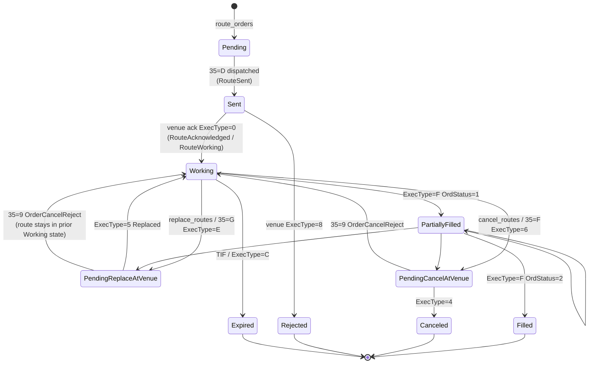

# Router Layer (OMS Layer 2)

The second OMS layer manages **routes** — the EMS's obligations to venues. One [[arch-order-staged|staged order]] can produce many routes; each route can have many fills.

## Concepts

- **Route**: a single outbound order to a single venue under a single dialect (FIX, binary, REST). It has its own lifecycle, its own ClOrdID-equivalent, and its own audit stream.
- **Fill**: a venue-reported partial or full execution against a route.
- **Replace / Cancel-Replace**: lifecycle operations within a route.

```
Order ──┐
        ├──► Route A ──► Fill, Fill, Fill
        ├──► Route B ──► Fill
        └──► Route C ──► (cancelled before fill)
```

## Route state machine

The route state machine is **FIX-aligned** end-to-end. State names mirror FIX `OrdStatus` (39) / `ExecType` (150) values. The canonical lifecycle — including `Pending Replace` (`150=E` / `39=E`), `Pending Cancel` (`150=6` / `39=6`), `Replaced` (`150=5`), `Canceled` (`150=4`), and the `OrderCancelReject` (`35=9`) reject paths — is in [[arch-order-route-lifecycle]].



`Working` is the live-at-venue state. **Replaces and cancels go through their own pending intermediate state** at the venue — they are not synchronous transitions. While a route sits in `PendingReplaceAtVenue`, the **original parameters remain workable** at the venue and fills may still print on them until the venue confirms `150=5 Replaced`.

> **FIX semantics: rejected cancel/replace does not terminate.** A `35=9 OrderCancelReject` returns the route to its prior `Working` (or `PartiallyFilled`) state. The original ClOrdID is still live. This is universal FIX behaviour and is what the EMS records. See [[arch-order-route-lifecycle]] for the full transition table and ClOrdID chaining rules.

## Route envelope

```
Route {
  route_id          UUID
  order_id          UUID                  // parent staged order
  venue             VenueRef              // see [[arch-venue-connectivity]]
  dialect           FIX|BIN|REST          // adapter-specific encoding
  cl_ord_id         string                // venue-facing ID, reusable per replace
  side / qty / price / tif                // copied from order; routes are concrete
  exec_inst         set<ExecInst>         // strategy-specific instructions
  algo_params       map?                  // when routing to algo, see [[route-to-algo]]
  state             PENDING|SENT|WORKING|FILLED|CANCELLED|REJECTED
  cum_qty / avg_px / last_qty / last_px
  fills             [Fill]
  reject_reason     ValidatorCode?        // see [[arch-validator]]
  sent_at / acked_at / terminal_at
  audit_link        order_event_id        // back-link into [[arch-event-sourcing]]
}
```

## How an order becomes routes

1. Order transitions `READY` (see [[arch-order-staged]]).
2. Either:
   - User calls `route_orders([{order_id, venue, qty, ...}])` — API. See [[arch-api-first]].
   - Automation rule fires and calls the same operation. See [[arch-automation-layer]].
   - The order has an auto-route policy — same operation, different `actor`.
3. Router creates one or more `Route` objects, validates each, and hands each to the relevant venue adapter.
4. Venue adapter encodes per dialect (FIX, binary, REST), emits over [[arch-venue-connectivity]].

## Partial routes

A single order can be split across multiple routes (different venues, different sizes, sequenced spot-first, etc. — see [[partial-routes]] and [[spot-first]]). The router enforces `sum(route.qty) <= order.remaining`. The remainder stays in the staged order, releasable later.

## Fills and downstream events

Every fill emits:

1. `RouteFilled` event (router stream).
2. `OrderFilled` event (order stream, `caused_by` = route fill).
3. A FIX `ExecutionReport` (`8`) to any FIX-paired client — see [[arch-fix-api-bridge]].
4. A downstream `AllocationRequested` event if an allocation template is attached to the order.

## Idempotency and ClOrdID rules

- `cl_ord_id` is unique per (firm, venue) for the lifetime of the route — including replaces. New `cl_ord_id` is minted per replace per FIX convention; the prior one is kept on the audit trail.
- Venue acks that arrive after a local cancel are reconciled, not double-processed.
- Late venue rejects that arrive after a "successful" local cancel produce a `RouteAnomaly` event for ops to triage.

## What stays out

- Building or evaluating rules. That is [[arch-automation-layer]].
- Deciding which broker/account to use. That is set on the [[arch-order-staged|staged order]] before routing.
- Quote distribution. That is [[arch-quote-server]].
- **Cross-venue split decisions, algo-wheel selection, dark-first probing, Reg-NMS slicing.** Those are [[arch-smart-order-router|SOR]]'s job. The router routes to a venue; if that venue is an SOR instance, SOR fans out to real venues. From the router's perspective the decomposition is invisible.

## See also

- [[arch-order-route-lifecycle]] · [[arch-fix-appendix-d]] · [[arch-fix-fsm-design]]
- [[arch-order-staged]] · [[arch-automation-layer]] · [[arch-venue-connectivity]] · [[arch-smart-order-router]]
- [[arch-validator]] · [[arch-fix-api-bridge]]
