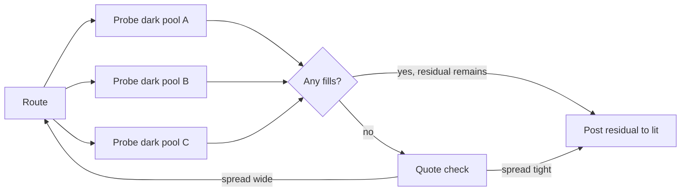

# Smart Order Router (SOR)

A **pluggable layer between [[arch-router-layer]] and [[arch-venue-connectivity]]** that decides — per route — which actual venue(s) to send to, how to slice, and (for buy-side flows) which broker/algo to pick. When SOR is active, it appears to the router as a **virtual venue**; when bypassed, the router goes directly to a concrete venue adapter. The plug-and-play property is the entire point.

Common SOR use cases:

- **Algo wheel** — systematic broker/algo selection (round-robin / weighted-random / commission-tier / performance-tier) for best-execution compliance.
- **Reg-NMS-compliant slicing** (US equity) — split across venues to respect NBBO and trade-through rules.
- **Dark-first liquidity discovery** — probe dark pools, then post to lit.
- **VWAP / TWAP / IS slicing** — internal scheduling vs. broker-hosted algos.
- **Anti-gaming randomization** — break predictable footprint patterns.
- **Cost-of-execution optimization** — route by maker-taker fee, exchange rebate, expected impact.
- **Liquidity-aware pegging** — dynamically reprice based on cross-venue [[arch-quote-server|quotes]].

## Position in the architecture

```mermaid
flowchart LR
  O[Order Layer<br/>[[arch-order-staged]]]
  R[Router Layer<br/>[[arch-router-layer]]]
  S[Smart Order Router<br/>this note]
  V1[Venue Adapter A]
  V2[Venue Adapter B]
  V3[Venue Adapter C]
  X1[Venue A]
  X2[Venue B]
  X3[Dark Pool C]

  O --> R
  R -- venue=SOR_EQ_US --> S
  R -. venue=BBG_FIT directly .-> V1
  S --> V1
  S --> V2
  S --> V3
  V1 --> X1
  V2 --> X2
  V3 --> X3
```

- When `route.venue` refers to an SOR instance (e.g. `SOR_EQ_US`), SOR receives the route and fans out.
- When `route.venue` refers to a concrete adapter (e.g. `BBG_FIT`, `MARKETAXESS`), SOR is bypassed entirely.
- Bypassing is the **default** — no SOR is active unless the firm/desk has opted in via setting cascade per [[arch-firm-desk-user]].

## Virtual-venue model

SOR registers itself as a venue. From [[arch-router-layer|the router]]'s perspective, it is indistinguishable from a real adapter at the schema level — same `Route` envelope, same lifecycle events, same FIX echoes. This keeps the router thin and lets SOR be added or removed without router changes.

Internally, SOR is **a parent route with child routes** — same composition pattern as [[arch-multileg|multileg]] orders and the cascading-cancel design in [[arch-fix-fsm-design]] § "Lifecycle Chaining":

```
Router emits: Route #501 → venue=SOR_EQ_US, qty=10000
              │
              ▼
            SOR receives Route #501
              ├── creates child Route #501.A → BBG_FIT, qty=4000   (algo wheel: Citi VWAP)
              ├── creates child Route #501.B → BBG_FIT, qty=3000   (algo wheel: GS IS)
              └── creates child Route #501.C → IEX_DARK, qty=3000
```

Child routes have their own FSM ([[arch-order-route-lifecycle]]). The parent SOR route's state is composed from its children — same `resolve_cascade()` pattern from the FSM design note. Cancel / replace of the parent cascades to children automatically.

## Strategy abstraction

SOR's behaviour is **selected by a Strategy**:

```
Strategy {
  strategy_id        string
  kind               ALGO_WHEEL | SLICER | LIQUIDITY_SEEKING | COST_OPTIMIZER | CUSTOM
  decide(route, market_context, history)
      -> CascadePlan { child_routes: [{venue, qty, params}], schedule? }
  on_child_event(child_event)
      -> [Action]        // adjust subsequent child dispatch, e.g. cancel-and-reroute on stale fill
}
```

Strategies are **registered**, **versioned**, and selected per route:

- Default per firm/desk via settings cascade.
- Per-order via `route.sor_strategy_id` (overrides default).
- Per-tag via [[arch-automation-layer|automation rules]] (e.g. orders tagged `#patient` use a slicer, orders tagged `#urgent` go direct).

### Strategy interface contract

- **Pure decision function.** `decide()` takes the route, current market context, and historical performance data; returns a cascade plan. No I/O. No clock reads (the clock is injected, see [[arch-time-replay-server]]). Replay reproduces identical decisions.
- **Reactive.** `on_child_event()` reacts to child fills / rejects / cancels — may emit further cascade-plan adjustments. Also pure.
- **Bounded effects.** All effects (sending sub-routes, cancelling sub-routes, posting quotes) flow through the standard `Effect` dispatcher from the FSM runtime — no shortcuts.

## Concrete strategies

### Algo Wheel

The user's example. Buy-side selection of broker/algo for best-execution compliance.

```mermaid
flowchart LR
  RT[Route arrives]
  W{Wheel Strategy}
  RR[Round-Robin pointer<br/>+ optional weights]
  PA[Performance-Tier<br/>history-driven weights]
  CP[Commission-Payout<br/>tier-driven weights]
  RAND[Random with seed<br/>(deterministic)]
  S[Pick broker + algo + params]

  RT --> W
  W --> RR
  W --> PA
  W --> CP
  W --> RAND
  RR --> S
  PA --> S
  CP --> S
  RAND --> S
```

#### Wheel mechanics

- A wheel has a **bucket list** — `[(broker_id, algo, weight, tuned_params)]`.
- A **pointer / RNG / scoring function** selects one bucket per route.
- The selection is **logged with rationale** so compliance can reconstruct why broker X was chosen for this order.

```yaml
# example algo wheel definition
wheel:
  id: EQ_US_LARGE_CAP_WHEEL
  selection_mode: WEIGHTED_RANDOM        # ROUND_ROBIN | WEIGHTED_RANDOM | PERFORMANCE_TIER | COMMISSION_TIER
  rng_seed_source: deterministic         # uses [[arch-time-replay-server|clock]] tick + route_id for replay-stable selection
  buckets:
    - broker: GS,    algo: VWAP,    weight: 25, params: { participation: 0.10, dark_pct: 0.30 }
    - broker: MS,    algo: IS,      weight: 25, params: { urgency: 0.5 }
    - broker: JPM,   algo: TWAP,    weight: 20, params: { slice_interval: 60s }
    - broker: CITI,  algo: POV,     weight: 20, params: { participation: 0.08 }
    - broker: BAML,  algo: VWAP,    weight: 10, params: { participation: 0.05 }
  eligibility:
    - require_tag: #cpty-{bucket.broker}    # the order's user must hold the cpty tag — per [[arch-tag-permissions]]
    - asset_class: equity
    - notional_range: { min: 1M, max: 50M }
  performance_feedback:
    metric: implementation_shortfall_bps
    window: 30d
    auto_rebalance_weights: false           # per firm policy; manual review preferred for compliance
```

#### Replay-stable selection

Random selection through the [[arch-time-replay-server|clock interface]] + per-route deterministic seed → same replay produces the same broker choice. Critical for audit reproducibility.

#### Why algo wheels exist

MiFID II RTS 27/28 and US best-execution rules require firms to demonstrate systematic, unbiased venue/broker selection. A documented algo wheel with logged selections, periodic performance review, and weight changes signed off by a Best Execution Committee is the standard implementation. The EMS storing the wheel definition, the per-trade selection event, and the input/output performance metrics is the audit chain.

### Slicer (VWAP / TWAP / IS / POV)

Internal scheduling: SOR takes a parent route and schedules child sub-routes over a time window per the strategy's profile.

- Each slice is a child route to a real venue (or another SOR target).
- Schedule advances via [[arch-time-replay-server|clock]] events.
- Mid-slice market state changes can trigger re-pacing via `on_child_event`.

### Liquidity-seeking / Dark-first



Configuration: dark-venue probe order, probe size, probe TIF (IOC by convention), and the lit-residual strategy.

### Reg-NMS-compliant slicer (US equity)

Trade-through prevention: SOR must route to the venue showing the best protected quote per Reg NMS. Implementation:

- Subscribe to consolidated quote per [[arch-quote-server]].
- Per slice, identify the protected quote venues.
- Route in order of price-time priority across protected quotes.
- Audit the SIP snapshot at slice time so a reg subpoena can reconstruct why a venue was chosen.

### Cost-of-execution optimizer

Routes to minimize an expected-cost function: `expected_cost = spread + impact_estimate − rebate + fee`. Per-venue fees / rebates are reference data; impact estimates come from a TCA model. Standard analytical optimization — the strategy plugs in the calibrated model.

### Anti-gaming randomization

Adds noise to slice sizes, slice timing, and venue selection within configured bands to defeat liquidity-detection algos that look for predictable footprints. Used in conjunction with the slicer or as a wrapper around any other strategy.

### Bypass / No-op strategy

```
strategy_id: PASSTHROUGH
decide(route): single child route to route.venue with original params
```

Used when SOR is registered as the routing target but the strategy is a no-op (for staged migration, A/B testing, or trivial flows). Equivalent to direct routing but goes through the SOR audit trail.

## Plug-and-play — how it stays optional

- The router has **no hard dependency on SOR**. Routes target venues; SOR is a venue.
- SOR is enabled by **firm/desk setting** `default_sor_for_{asset_class} = SOR_EQ_US_V2`. Without the setting, routes target real venues directly.
- A single order can have routes that go through different SOR instances (or none) — the strategy is per-route, not per-order.
- Removing SOR is **a configuration change**, not a code change.

## State-machine integration

SOR routes use the **same Route FSM** ([[arch-order-route-lifecycle]]). SOR is composed:

- The parent route (with `venue=SOR_xxx`) is an instance of the Route FSM.
- It composes N child routes (per [[arch-fix-fsm-design]] § composition + cascading).
- Cascading cancel / replace cascade automatically.
- The full Appendix D edge-case catalogue ([[arch-fix-appendix-d]]) applies at both parent and child level.

### What's new at the SOR level

A small additional FSM event vocabulary, expressed in the same definition format:

```yaml
# delta on top of route.fsm.yaml
events:
  - { name: SorStrategySelected,       direction: out }
  - { name: SorChildDispatched,        direction: out }
  - { name: SorPlanAdjusted,           direction: out }   # reactive replan
  - { name: SorWheelSelectionLogged,   direction: out }   # algo wheel audit
transitions:
  # When a Route with venue=SOR_xxx arrives at the SOR component,
  # it transitions through SorStrategySelected before any child dispatch.
  - { from: Sent, on: SorStrategyDecided,
      to: Sent,                                       # still Sent until first child acks
      emit: [SorStrategySelected, SorWheelSelectionLogged],
      effects: [DispatchChildren(plan.child_routes)] }
```

The wheel selection event carries the bucket chosen, the alternatives considered, the weights, the seed, and a hash of the wheel definition version. **All four** are needed for compliance audit.

## Feedback loop — performance tracking

SOR consumes its own emitted fill events (via [[arch-event-sourcing|the event log]]) and projects per-strategy / per-bucket performance metrics:

| Metric | Source |
|---|---|
| Fill rate | child route fill / route requested |
| Slippage vs. arrival | child fill price vs. quote at SorStrategySelected |
| Slippage vs. benchmark (VWAP / Arrival / Close) | same, vs. benchmark window |
| Latency | route_request → first child fill |
| Reject rate | venue rejects per bucket |
| Effective spread | per child fill |
| Fees / rebates actual vs. expected | venue fee schedule lookup |

Metrics feed a **TCA projection** that the algo wheel can consult for `PERFORMANCE_TIER` selection — but the loop is **read-only from the wheel's perspective**: the wheel reads the rolling metrics; weight changes go through manual sign-off by the Best Execution Committee (firm-policy; some firms permit auto-rebalance with tight bounds and full audit).

## Compliance / audit specifics

For every SOR-routed parent, the event stream must include enough to reconstruct:

1. **Why this strategy was selected** (per-route policy, tag, or default).
2. **The strategy's version** (wheel definition hash, slicer params).
3. **The decision rationale** (wheel bucket + weight + seed; or slicer schedule; or liquidity-seeker probe order).
4. **The alternatives** (every bucket considered; for slicers, the schedule plan).
5. **Each child dispatch** (venue, params, qty, timing) with `caused_by` linking to the parent's `SorStrategySelected`.
6. **Each child fill / reject / cancel**.
7. **The post-trade performance metric** for the parent route, computed on terminal.

This is the documentation a regulator asks for in a best-execution audit. Storing it as event-sourced data means subpoena response is mechanical.

## Permission model

Routes via SOR are subject to the standard [[arch-tag-permissions|3-layer tag AND-gate]] **plus** SOR-specific tags:

- `#sor-route` to use SOR at all.
- `#sor-strategy-{id}` per strategy (some strategies are restricted, e.g. dark-only).
- `#algo-wheel-admin` to register / amend wheels (typically tagged to Best Execution Committee members).
- `#auto-wheel-rebalance` to enable automatic weight rebalancing (rare).

## Anti-patterns

- **SOR as a "magic box".** Without per-decision audit, regulators reject the algo wheel as opaque. Always log inputs, weights, seeds, and the chosen bucket.
- **Hand-coded venue selection in the router.** Defeats the plug-and-play property. The router never decides venues; it routes to whatever venue the operation says (which may be SOR).
- **Strategy decisions calling external services synchronously in the hot path.** Breaks replay determinism. Pre-fetch reference data; inject TCA metrics as context, not on-demand.
- **Mutable strategy state without versioning.** A wheel whose weights changed last week but with no recorded change event makes replay non-reproducible.
- **One strategy serving all asset classes.** FX, equity, and FI have radically different microstructure. Strategies must be asset-class-scoped; wheels too.
- **Skipping the validator.** SOR routes must still pass the standard [[arch-validator|validator]] — per-venue cpty checks, limit checks, FIGI license metering. The wheel's bucket eligibility filter narrows the choice set; the validator gates each child dispatch.

## API surface

SOR ops join the existing API per [[arch-api-first]]:

```
operation: route_orders                  # unchanged at the caller level
items: [{ order_id, venue: SOR_EQ_US, sor_strategy_id?, ... }]

operation: register_algo_wheel
items: [{ wheel_id, buckets, selection_mode, eligibility, ... }]

operation: amend_algo_wheel
items: [{ wheel_id, fields, change_reason, signed_off_by }]

operation: list_wheel_selections(filter)         # audit / TCA

operation: query_strategy_performance(strategy_id, window)
```

Each `register_algo_wheel` / `amend_algo_wheel` emits a `WheelDefinitionChanged` event with the change reason and signing identity captured.

## Validator codes touched

`EMS-RTE-1020` (SOR strategy not eligible for instrument), `EMS-RTE-1021` (wheel bucket eligibility fails), `EMS-RTE-1022` (SOR child child-route validator fails — per-child), `EMS-PRM-1801` (`#sor-strategy-{id}` missing), `EMS-RTE-9020` (wheel definition pinned-version unavailable).

## See also

- [[arch-router-layer]] · [[arch-venue-connectivity]] · [[arch-order-route-lifecycle]] · [[arch-fix-fsm-design]] · [[arch-fix-appendix-d]]
- [[arch-quote-server]] · [[arch-event-sourcing]] · [[arch-time-replay-server]] · [[arch-validator]] · [[arch-tag-permissions]] · [[arch-firm-desk-user]]
- [[arch-automation-layer]] (rules can swap SOR strategy per tag)
- [[route-single]] · [[route-to-algo]] · [[multi-route-rfq]] · [[partial-routes]] · [[fx-automation-tradebest]] · [[fx-automation-rbld]]
