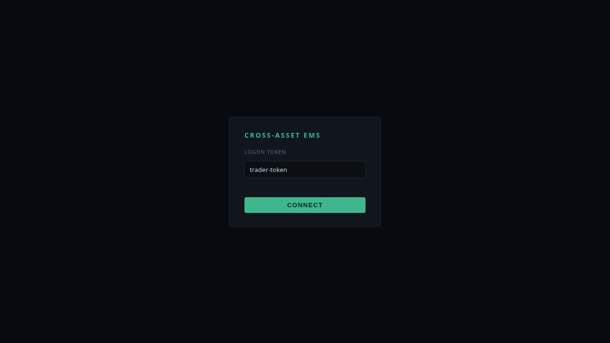
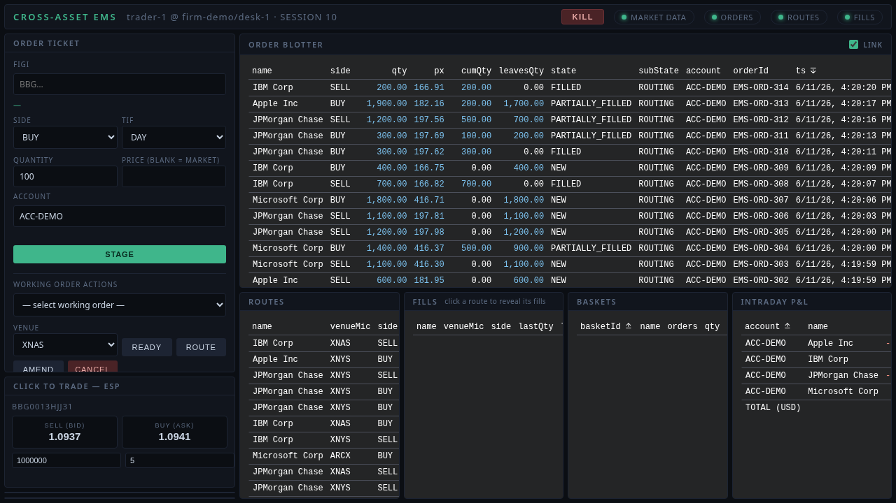
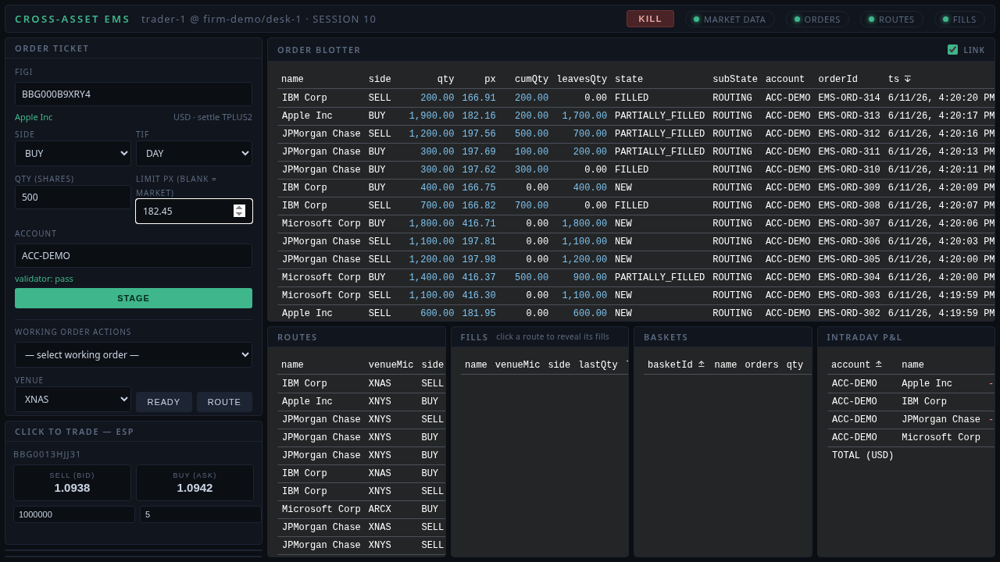
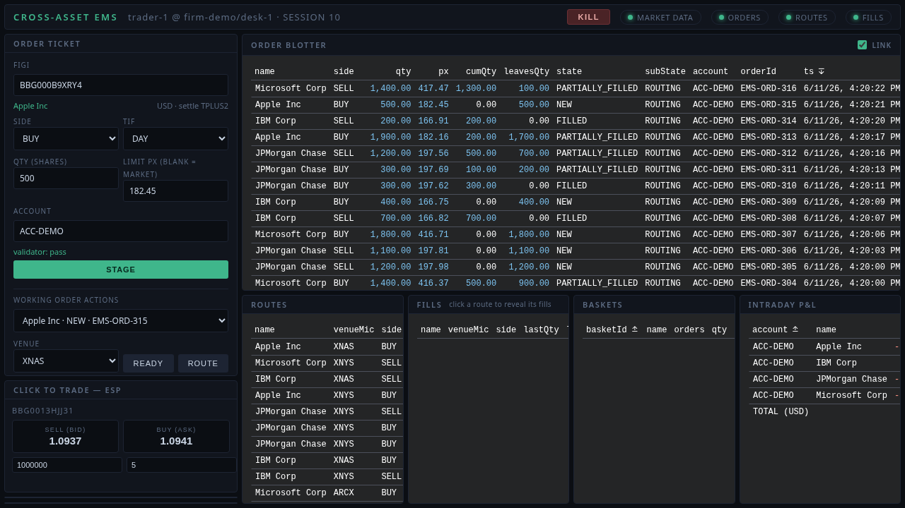
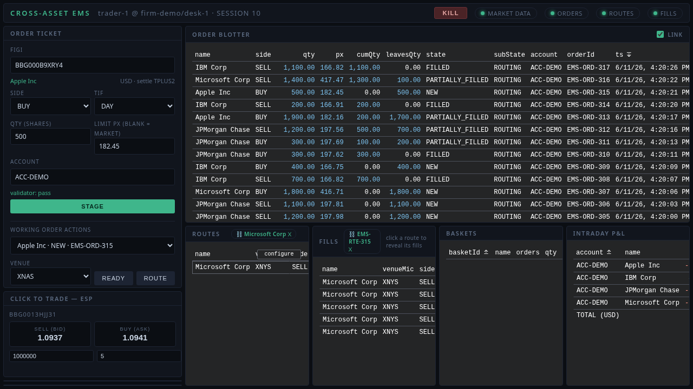
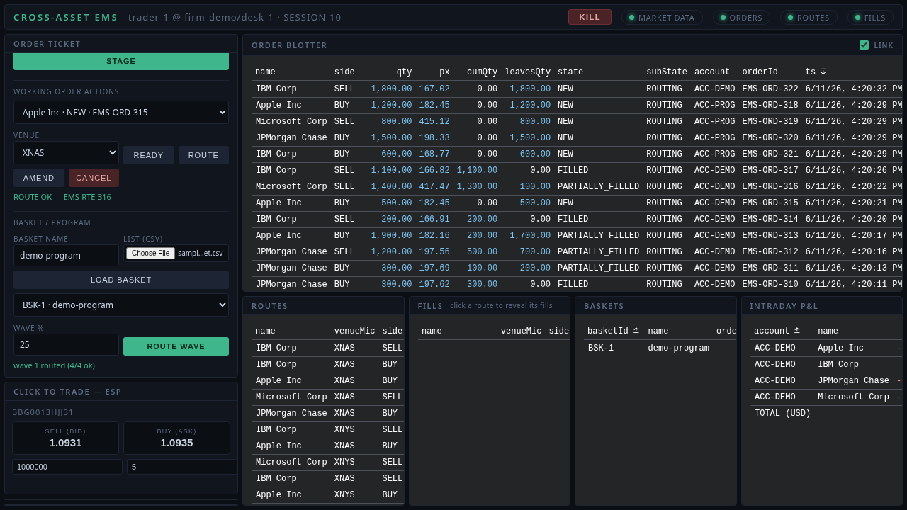
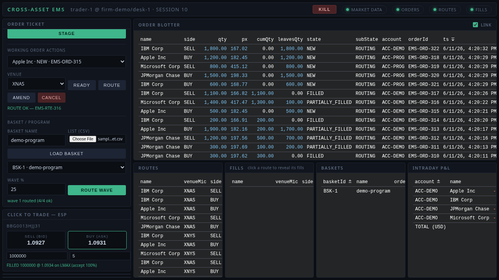
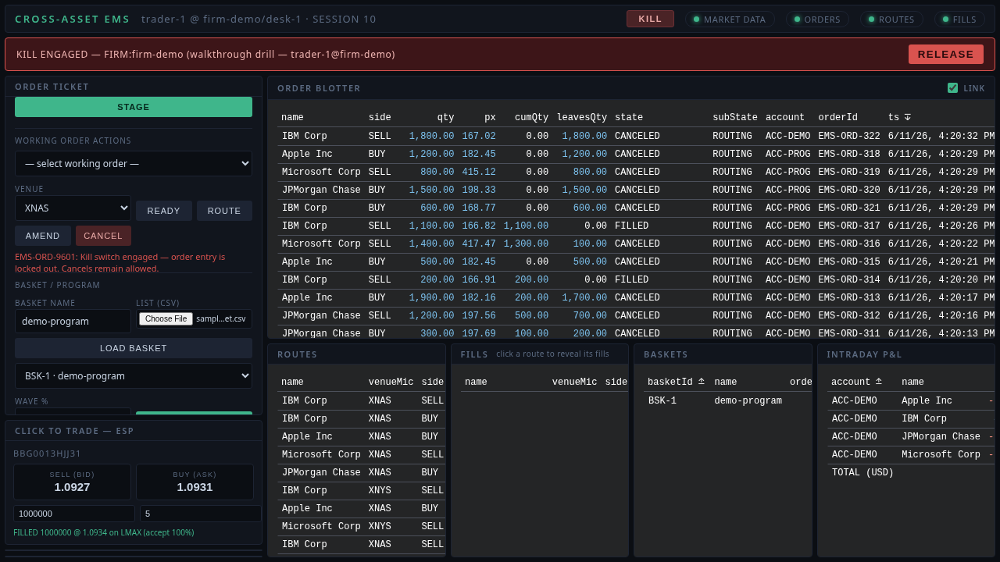
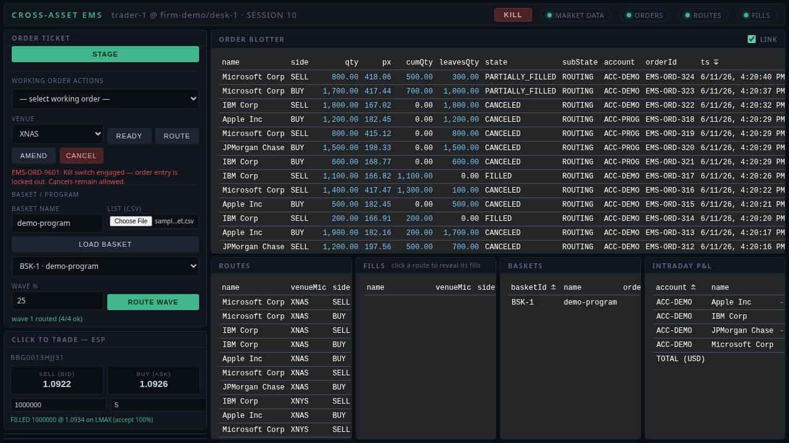

# Demo — Trader Desktop, End to End

A 30-second recording of the system operating itself: logon, live blotter, an order worked
through the ticket, a basket wave, an ESP click-to-trade, and a firm-wide kill drill — all against
the real backend (validator, kill-switch-guarded OMS, streams), recorded headless with Playwright.

**▶ Video: [`docs/demo/trader-desktop-demo.mp4`](docs/demo/trader-desktop-demo.mp4)** (2.8 MB)

Run it yourself — one command, then open http://localhost:5173 and log on with `trader-token`:

```bash
./scripts/dev/run-trader-demo.sh
```

The full guided walkthrough (every panel, every backend call, troubleshooting) is
[`docs/TRADER_DESKTOP_DEMO.md`](docs/TRADER_DESKTOP_DEMO.md).

---

## The tour, frame by frame

Every screenshot below is from the recording; nothing is mocked at the UI layer — all rows arrive
over cursor-resumable per-topic WebSockets, all actions are REST batch envelopes.

### 1. Logon

`POST /api/v1/logon` with the demo token returns `{sessionId, firm, desk, user}`; the desktop then
opens one WebSocket per topic and replays each from cursor 1.



### 2. The live desk

Orders / routes / fills stream into indexed Perspective (WASM) tables as keyed row deltas — the
demo bot's flow walks `NEW → ROUTING → PARTIALLY_FILLED → FILLED` on screen. Watchlist ticks via
the market-data SPI; intraday P&L re-snapshots every 2s; the EURUSD ESP tile quotes ~2×/second.



### 3. Ticket with server-side preview

Typing a FIGI fires `GET /api/v1/instruments/{figi}` (asset class drives the field layout) and
`POST /api/v1/preview_validate` — a dry run of the *same* validator the stage path enforces.
"validator: pass" is the server's verdict, not client-side validation.



### 4. Stage → ready → route

`stage_orders` → `mark_ready` → `route_orders`; the staged order and its `SENT` route arrive back
through the blotter streams — REST in, WebSocket out.



### 4b. Linked blotter, fills on demand

Click an order and ROUTES filters to it (the ⛓ chip clears the link); click a route and FILLS
reveals just that route's executions — fills stay hidden otherwise, because fill volume is the
render cost on a busy desk. Ctrl+click multi-selects rows; right-click opens the action menu
(ready / route / cancel / aggregate-into-basket). Security names lead every grid; the FIGI is an
optional column via each panel's settings (⚙) — which also gives per-column group/sort/filter.



### 5. Basket wave

The bundled [`sample-basket.csv`](ui/trader-desktop/demo/sample-basket.csv) loads through the CSV
importer (4 orders staged), then one wave routes 25% of each constituent's unrouted remaining; the
BASKETS grid rollup (`qty/cum/%/waves`) ticks live as fills arrive.



### 6. Click-to-trade with slippage guard

Clicking BUY sends the on-screen price as `expectedPx`; the EMS rejects locally if the stream
moved beyond the guard (the dealer never sees it), otherwise the dealer's last look answers —
fills carry the venue's running accept-rate.



### 7. Kill drill

KILL engages lockout *before* the audited mass-cancel (failures counted, never silent): every
working order flips to `CANCELED`, the banner shows the engaged scope, and staging rejects with
`EMS-ORD-9601` until RELEASE — the same control the 15c3-5 attestation pack exports evidence for.



### 8. Back to normal

Release restores entry, the CRITICAL alert is acknowledged in the notifications queue, and the
desk keeps streaming.



---

## Re-recording

The recording is reproducible — with the demo stack running:

```bash
cd ui/trader-desktop
npx playwright install chromium     # once
node demo/record-demo.mjs           # writes docs/demo/* (webm; convert with ffmpeg if needed)
```
